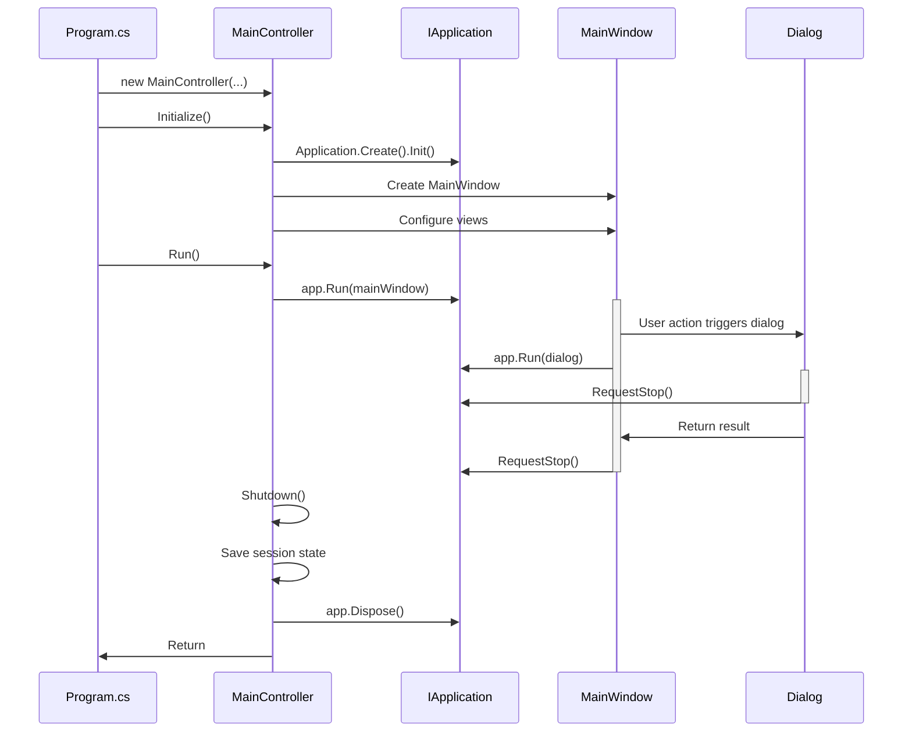

# Design Document: Terminal.Gui v2 Migration

## Overview

This document describes the design for migrating TWF (Two-pane Window Filer) from Terminal.Gui v1.19.0 to v2.x. The migration involves a fundamental architectural shift from static, global-state-based patterns to instance-based, dependency-injected patterns. This design follows a phased approach to minimize risk and enable incremental validation.

### Migration Goals

1. **Eliminate Global State**: Replace all static `Application.*` references with instance-based `IApplication` pattern
2. **Proper Resource Management**: Implement IDisposable pattern throughout the application
3. **Type-Safe Dialog Results**: Use `IRunnable<TResult>` pattern for dialogs with return values
4. **Enable TrueColor**: Support 24-bit RGB colors for enhanced visual experience
5. **Improve Testability**: Decouple views from global state for better unit testing
6. **Maintain Compatibility**: Preserve all existing functionality and configuration files
7. **Enable Future Features**: Prepare architecture for Sixel images, themes, and view arrangement

### Key Architectural Changes

**From v1 Pattern:**
```csharp
// Static, global state
Application.Init();
Application.Top.Add(window);
Application.Run();
Application.Shutdown();

// Global access
Application.Driver.MakeAttribute(fg, bg);
Application.MainLoop.Invoke(() => { });
```

**To v2 Pattern:**
```csharp
// Instance-based, dependency injection
using (IApplication app = Application.Create().Init())
{
    Window window = new();
    app.Run(window);
    window.Dispose();
} // app.Dispose() called automatically

// View-scoped access
View.App?.Driver.MakeAttribute(fg, bg);
View.App?.MainLoop.Invoke(() => { });
```

## Architecture

### Component Hierarchy

```
Program.cs
  └─> MainController (owns IApplication instance)
       ├─> IApplication (lifecycle management)
       ├─> MainWindow
       │    ├─> TabBarView
       │    ├─> PaneView (Left)
       │    ├─> PaneView (Right)
       │    ├─> TaskStatusView
       │    └─> StatusBar
       ├─> Services (receive IApplication or use View.App)
       │    ├─> KeyBindingManager
       │    ├─> FileOperations
       │    ├─> MacroExpander
       │    ├─> CustomFunctionManager
       │    ├─> ViewerManager
       │    └─> Others
       └─> Dialogs (executed via app.Run())
            ├─> FileCollisionDialog
            ├─> ConfirmationDialog
            ├─> CustomFunctionDialog
            └─> ~37 other dialogs
```

### Lifecycle Flow



### Phase-Based Migration Strategy

The migration is organized into 6 phases to enable incremental progress and validation:

**Phase 1: Preparation**
- Update Terminal.Gui package to v2.x
- Audit all `Application.*` usage
- Create feature branch
- Verify test environment

**Phase 2: Core Application Migration**
- Update `MainController.Initialize()` to create `IApplication` instance
- Update `MainController.Run()` to use instance-based pattern
- Update `MainController.Shutdown()` to dispose properly
- Implement `IDisposable` in `MainController`

**Phase 3: Dialog Migration**
- Identify dialog patterns (simple vs result-returning)
- Update all ~40+ dialog invocations
- Implement proper disposal for dialogs
- Update service classes that invoke dialogs

**Phase 4: Global State Elimination**
- Update `ConfigurationProvider` to remove `Application.Top` checks
- Update `KeyBindingManager` to remove `Application.Top` checks
- Update all `Application.MainLoop.Invoke` calls
- Pass `IApplication` instance or use `View.App` property

**Phase 5: View Updates**
- Update custom views to use `View.App` property
- Update color scheme initialization
- Update timer and invoke patterns
- Implement `IDisposable` where needed

**Phase 6: Testing & Validation**
- Run all unit tests
- Run all property-based tests
- Perform integration testing
- Execute manual testing checklist
- Validate performance improvements

## Components and Interfaces

### MainController Changes

**Current (v1):**
```csharp
public class MainController
{
    public void Initialize()
    {
        Application.Init();
        // ... setup
    }
    
    public void Run()
    {
        Application.Top.Add(_mainWindow);
        Application.Run();
    }
    
    private void Shutdown()
    {
        // ... save state
        Application.Shutdown();
    }
}
```

**New (v2):**
```csharp
public class MainController : IDisposable
{
    private IApplication? _app;
    private bool _disposed;
    
    public void Initialize()
    {
        _app = Application.Create().Init();
        // ... setup
    }
    
    public void Run()
    {
        if (_app == null || _mainWindow == null)
            throw new InvalidOperationException("Must call Initialize first");
            
        _app.Run(_mainWindow);
    }
    
    private void Shutdown()
    {
        if (_disposed) return;
        
        try
        {
            // ... save state
        }
        finally
        {
            _app?.Dispose();
            _mainWindow?.Dispose();
            _disposed = true;
        }
    }
    
    public void Dispose()
    {
        Shutdown();
        GC.SuppressFinalize(this);
    }
}
```

### Dialog Execution Patterns

**Pattern 1: Simple Dialog (No Result)**
```csharp
// v1 Pattern
var dialog = new MessageDialog("Title", "Message");
Application.Run(dialog);

// v2 Pattern (caller owns disposal)
var dialog = new MessageDialog("Title", "Message");
_app?.Run(dialog);
dialog.Dispose();
```

**Pattern 2: Dialog with Result (IRunnable<TResult>)**
```csharp
// v1 Pattern
var dialog = new FileCollisionDialog(source, dest);
Application.Run(dialog);
var result = dialog.Result;

// v2 Pattern Option A (framework owns disposal)
_app?.Run<FileCollisionDialog>();
var result = _app?.GetResult<FileCollisionResult>();

// v2 Pattern Option B (caller owns disposal)
var dialog = new FileCollisionDialog(source, dest);
_app?.Run(dialog);
var result = dialog.Result;
dialog.Dispose();
```

**Pattern 3: Dialog with Constructor Parameters**
```csharp
// v2 Pattern (caller owns disposal - required for constructor params)
var dialog = new CustomFunctionDialog(_config, _customFunctionManager);
_app?.Run(dialog);
if (dialog.IsOk)
{
    // Use dialog results
}
dialog.Dispose();
```

### Service Class Updates

**ConfigurationProvider:**
```csharp
// v1 Pattern
public void ShowError(string message)
{
    if (Application.Top != null)
    {
        Application.MainLoop.Invoke(() =>
        {
            MessageBox.ErrorQuery("Error", message, "OK");
        });
    }
}

// v2 Pattern (pass IApplication)
private readonly IApplication? _app;

public ConfigurationProvider(IApplication? app = null)
{
    _app = app;
}

public void ShowError(string message)
{
    _app?.MainLoop.Invoke(() =>
    {
        MessageBox.ErrorQuery("Error", message, "OK");
    });
}
```

**KeyBindingManager:**
```csharp
// v1 Pattern
public void ShowBindingError(string message)
{
    if (Application.Top != null)
    {
        Application.MainLoop.Invoke(() =>
        {
            var dialog = new MessageDialog("Error", message);
            Application.Run(dialog);
        });
    }
}

// v2 Pattern (pass IApplication)
private readonly IApplication? _app;

public KeyBindingManager(IApplication? app = null)
{
    _app = app;
}

public void ShowBindingError(string message)
{
    _app?.MainLoop.Invoke(() =>
    {
        var dialog = new MessageDialog("Error", message);
        _app.Run(dialog);
        dialog.Dispose();
    });
}
```

### Custom View Updates

**PaneView Color Scheme:**
```csharp
// v1 Pattern
private Attribute GetCursorColorAttribute()
{
    return Application.Driver.MakeAttribute(foreground, background);
}

// v2 Pattern
private Attribute GetCursorColorAttribute()
{
    return App?.Driver?.MakeAttribute(foreground, background) 
           ?? new Attribute(Color.White, Color.Black);
}
```

**TextViewerWindow Timer:**
```csharp
// v1 Pattern
_statusUpdateToken = Application.MainLoop.AddTimeout(
    TimeSpan.FromMilliseconds(500), 
    (loop) => { /* update */ return true; }
);

// v2 Pattern
_statusUpdateToken = App?.MainLoop.AddTimeout(
    TimeSpan.FromMilliseconds(500),
    (loop) => { /* update */ return true; }
);
```

**TaskStatusView Timer:**
```csharp
// v1 Pattern
Application.MainLoop.AddTimeout(
    TimeSpan.FromMilliseconds(refreshInterval),
    (loop) => { ProcessPendingLogs(); return true; }
);

// v2 Pattern
App?.MainLoop.AddTimeout(
    TimeSpan.FromMilliseconds(refreshInterval),
    (loop) => { ProcessPendingLogs(); return true; }
);
```

## Data Models

### IApplication Instance Management

The `IApplication` instance is the central lifecycle object that must be:
1. Created once during initialization
2. Stored as a field in `MainController`
3. Passed to services that need application access
4. Disposed properly during shutdown

**Storage:**
```csharp
public class MainController : IDisposable
{
    private IApplication? _app;
    private bool _disposed;
}
```

**Initialization:**
```csharp
public void Initialize()
{
    _app = Application.Create().Init();
    
    // Pass to services that need it
    _configProvider.SetApplication(_app);
    _keyBindings.SetApplication(_app);
}
```

**Disposal:**
```csharp
public void Dispose()
{
    if (_disposed) return;
    
    try
    {
        SaveSessionState();
    }
    finally
    {
        _app?.Dispose();
        _mainWindow?.Dispose();
        _disposed = true;
    }
    
    GC.SuppressFinalize(this);
}
```

### Dialog Result Types

Dialogs that return results should define their result types clearly:

```csharp
// File collision dialog result
public class FileCollisionResult
{
    public FileCollisionAction Action { get; set; }
    public bool ApplyToAll { get; set; }
    public string? NewName { get; set; }
}

// Simple confirmation result
public class ConfirmationResult
{
    public bool Confirmed { get; set; }
}

// Custom function selection result
public class CustomFunctionResult
{
    public CustomFunction? SelectedFunction { get; set; }
    public bool IsOk { get; set; }
}
```

### Session State Compatibility

Session state must remain compatible between v1 and v2:

```csharp
public class SessionState
{
    // Existing fields (unchanged)
    public string LeftPath { get; set; }
    public string RightPath { get; set; }
    public string? LeftFocusTarget { get; set; }
    public string? RightFocusTarget { get; set; }
    public string LeftMask { get; set; }
    public string RightMask { get; set; }
    public SortMode LeftSort { get; set; }
    public SortMode RightSort { get; set; }
    public DisplayMode LeftDisplayMode { get; set; }
    public DisplayMode RightDisplayMode { get; set; }
    public bool LeftPaneActive { get; set; }
    public List<string> LeftHistory { get; set; }
    public List<string> RightHistory { get; set; }
    public int ActiveTabIndex { get; set; }
    public int TaskPaneHeight { get; set; }
    public bool TaskPaneExpanded { get; set; }
    public List<TabSessionState> Tabs { get; set; }
    
    // No new fields needed for v2 migration
}
```

## Correctness Properties

*A property is a characteristic or behavior that should hold true across all valid executions of a system—essentially, a formal statement about what the system should do. Properties serve as the bridge between human-readable specifications and machine-verifiable correctness guarantees.*

### Property 1: Application Lifecycle Initialization

*For any* MainController instance, after calling Initialize(), the controller should have a non-null IApplication instance that is properly initialized and ready to run views.

**Validates: Requirements 1.1**

### Property 2: Application Lifecycle Disposal

*For any* MainController instance, after calling Dispose(), all resources (IApplication, Window, Views) should be properly disposed and no resource leaks should exist.

**Validates: Requirements 1.3, 4.1, 4.5, 4.6**

### Property 3: Exception-Safe Disposal

*For any* MainController instance, even when exceptions occur during shutdown, the IApplication instance should still be disposed properly through try-finally blocks.

**Validates: Requirements 1.7, 4.5**

### Property 4: Session State Round-Trip

*For any* valid session state, saving then loading the session state should produce an equivalent session state with all paths, tabs, history, and settings preserved.

**Validates: Requirements 1.6, 9.4, 9.5, 9.6, 9.7, 9.8, 9.9**

### Property 5: Dialog Execution and Disposal

*For any* dialog instance, after executing via app.Run(dialog) and completion, the dialog should be properly disposed and not leak resources.

**Validates: Requirements 2.1, 2.3, 4.3**

### Property 6: Dialog Result Retrieval

*For any* dialog implementing IRunnable<TResult>, after execution, the result should be retrievable via GetResult<T>() and match the dialog's internal result state.

**Validates: Requirements 2.2**

### Property 7: RequestStop Functionality

*For any* running IRunnable, calling Application.RequestStop() should stop the runnable and return control to the caller without errors.

**Validates: Requirements 2.6**

### Property 8: Configuration File Compatibility

*For any* valid v1 configuration file (config.json, keybindings.json, custom_functions.json), the v2 system should load it without modification and apply all settings correctly.

**Validates: Requirements 9.1, 9.2, 9.3, 5.4**

### Property 9: Color System TrueColor Support

*For any* RGB color value in configuration, when TrueColor is available, the system should render the color using 24-bit RGB values.

**Validates: Requirements 5.3, 14.1, 14.2**

### Property 10: Color System Fallback

*For any* color configuration, when TrueColor is unavailable, the system should fall back to 256-color or 16-color mode without crashing.

**Validates: Requirements 14.3, 14.4**

### Property 11: Key Binding Preservation

*For any* valid keybindings.json file, all configured key bindings should work identically in v2 as they did in v1.

**Validates: Requirements 7.2, 7.3, 7.5**

### Property 12: Event Handler Invocation

*For any* event subscription, when the event is raised, the handler should be invoked with correct event arguments.

**Validates: Requirements 6.4, 6.5**

### Property 13: Clipboard Operations

*For any* text content, copying to clipboard then pasting should return the same text content.

**Validates: Requirements 15.1, 15.2, 15.3**

### Property 14: Error Handling and Logging

*For any* error condition during migration operations (disposal, dialog execution, etc.), the system should log the error and continue gracefully without crashing.

**Validates: Requirements 17.1, 17.2, 17.3**

### Property 15: View Disposal in Tests

*For any* property-based test that creates views or dialogs, all created resources should be properly disposed after the test completes.

**Validates: Requirements 4.7**

## Error Handling

### Disposal Error Handling

Disposal operations must be resilient to errors:

```csharp
public void Dispose()
{
    if (_disposed) return;
    
    try
    {
        // Save session state (may throw)
        SaveSessionState();
    }
    catch (Exception ex)
    {
        _logger.LogError(ex, "Error saving session state during disposal");
        // Continue with disposal even if save fails
    }
    finally
    {
        try
        {
            _app?.Dispose();
        }
        catch (Exception ex)
        {
            _logger.LogError(ex, "Error disposing IApplication");
        }
        
        try
        {
            _mainWindow?.Dispose();
        }
        catch (Exception ex)
        {
            _logger.LogError(ex, "Error disposing main window");
        }
        
        _disposed = true;
    }
    
    GC.SuppressFinalize(this);
}
```

### Null Driver Handling

When `Application.Driver` is null (during initialization or in tests), handle gracefully:

```csharp
private Attribute GetColorAttribute(Color fg, Color bg)
{
    // Graceful fallback when Driver is null
    if (App?.Driver == null)
    {
        return new Attribute(fg, bg);
    }
    
    return App.Driver.MakeAttribute(fg, bg);
}
```

### Dialog Execution Error Handling

Dialog execution should handle errors gracefully:

```csharp
public void ShowCustomFunctionDialog()
{
    CustomFunctionDialog? dialog = null;
    try
    {
        dialog = new CustomFunctionDialog(_config, _customFunctionManager);
        _app?.Run(dialog);
        
        if (dialog.IsOk && dialog.SelectedFunction != null)
        {
            ExecuteCustomFunction(dialog.SelectedFunction);
        }
    }
    catch (Exception ex)
    {
        _logger.LogError(ex, "Error executing custom function dialog");
        MessageBox.ErrorQuery("Error", $"Failed to show dialog: {ex.Message}", "OK");
    }
    finally
    {
        dialog?.Dispose();
    }
}
```

### MainLoop.Invoke Error Handling

MainLoop.Invoke calls should handle null app:

```csharp
public void UpdateUIFromBackground(string message)
{
    if (_app == null)
    {
        _logger.LogWarning("Cannot update UI: IApplication is null");
        return;
    }
    
    _app.MainLoop.Invoke(() =>
    {
        try
        {
            _statusLabel.Text = message;
            _statusLabel.SetNeedsDraw();
        }
        catch (Exception ex)
        {
            _logger.LogError(ex, "Error updating UI from background thread");
        }
    });
}
```

## Testing Strategy

### Dual Testing Approach

The migration requires both unit tests and property-based tests:

**Unit Tests:**
- Verify specific examples and edge cases
- Test integration points between components
- Test error conditions and exception handling
- Test specific dialog behaviors
- Test view lifecycle events

**Property-Based Tests:**
- Verify universal properties across all inputs
- Test resource disposal with random sequences
- Test session state round-trips with random data
- Test configuration loading with various valid configs
- Test color system with random color values
- Test key bindings with random key combinations

**Complementary Coverage:**
- Unit tests catch concrete bugs in specific scenarios
- Property tests verify general correctness across input space
- Together they provide comprehensive validation

### Property Test Configuration

All property-based tests must:
1. Run minimum 100 iterations (due to randomization)
2. Reference the design document property number
3. Use tag format: `Feature: terminal-gui-v2-migration, Property {number}: {property_text}`
4. Properly dispose all created resources

**Example Property Test:**
```csharp
[Property(Arbitrary = new[] { typeof(Generators) })]
[Trait("Feature", "terminal-gui-v2-migration")]
[Trait("Property", "2")]
public Property ApplicationLifecycleDisposal(MainControllerTestData data)
{
    // Feature: terminal-gui-v2-migration, Property 2: Application Lifecycle Disposal
    // For any MainController instance, after calling Dispose(), 
    // all resources should be properly disposed
    
    var controller = new MainController(/* dependencies */);
    controller.Initialize();
    
    // Track resource creation
    var resourceTracker = new ResourceTracker();
    resourceTracker.TrackController(controller);
    
    // Dispose controller
    controller.Dispose();
    
    // Verify all resources disposed
    return resourceTracker.AllResourcesDisposed().ToProperty();
}
```

### Unit Test Examples

**Test Application Initialization:**
```csharp
[Fact]
public void Initialize_CreatesIApplicationInstance()
{
    // Arrange
    var controller = CreateMainController();
    
    // Act
    controller.Initialize();
    
    // Assert
    Assert.NotNull(controller.GetApplication()); // Expose for testing
    Assert.True(controller.IsInitialized);
}
```

**Test Dialog Disposal:**
```csharp
[Fact]
public void RunDialog_DisposesDialogAfterExecution()
{
    // Arrange
    using var app = Application.Create().Init();
    var dialog = new TestDialog();
    var disposeCalled = false;
    dialog.Disposed += (s, e) => disposeCalled = true;
    
    // Act
    app.Run(dialog);
    dialog.Dispose();
    
    // Assert
    Assert.True(disposeCalled);
}
```

**Test Session State Preservation:**
```csharp
[Fact]
public void Shutdown_SavesSessionState()
{
    // Arrange
    var controller = CreateMainController();
    controller.Initialize();
    controller.SetLeftPath("/test/path");
    controller.SetActiveTab(2);
    
    // Act
    controller.Dispose();
    
    // Assert
    var savedState = LoadSessionState();
    Assert.Equal("/test/path", savedState.LeftPath);
    Assert.Equal(2, savedState.ActiveTabIndex);
}
```

### Integration Testing

Integration tests verify end-to-end workflows:

1. **Application Startup and Shutdown**
   - Initialize → Run → Dispose
   - Verify no resource leaks
   - Verify session state saved

2. **Dialog Workflows**
   - Open dialog → Interact → Close
   - Verify result retrieval
   - Verify disposal

3. **File Operations**
   - Navigate → Mark files → Copy/Move/Delete
   - Verify operations complete
   - Verify UI updates

4. **Viewer Windows**
   - Open text viewer → Navigate → Close
   - Open image viewer → Navigate → Close
   - Verify disposal

5. **Tab Management**
   - Create tabs → Switch tabs → Close tabs
   - Verify state preservation
   - Verify disposal

### Manual Testing Checklist

After automated tests pass, perform manual testing:

- [ ] Application starts without errors
- [ ] Main window displays correctly
- [ ] File navigation works (up, down, enter, backspace)
- [ ] Drive selection works (Alt+F1, Alt+F2)
- [ ] File operations work (F5 copy, F6 move, F8 delete)
- [ ] Marking works (Insert, +, -, *)
- [ ] Search works (Ctrl+S incremental search)
- [ ] Text viewer works (F3)
- [ ] Image viewer works (if applicable)
- [ ] Custom functions work (F2 menu)
- [ ] Keyboard bindings work (all configured keys)
- [ ] Tab management works (Ctrl+T, Ctrl+W, Ctrl+Tab)
- [ ] Task status view works (Ctrl+O)
- [ ] Help system works (F1)
- [ ] Configuration loads correctly
- [ ] Session state restores correctly
- [ ] Application exits cleanly (no errors)
- [ ] CPU usage is lower than v1 (measure with Task Manager)
- [ ] UI feels responsive and snappy

### Performance Validation

Compare v2 performance to v1 baseline:

**Metrics to Measure:**
1. CPU usage while idle (should be lower)
2. CPU usage during file list refresh
3. Memory usage over time (should be stable)
4. Dialog open time (should be <100ms)
5. Tab switch time (should be <100ms)
6. Frame render time (should be <16ms for 60 FPS)

**Measurement Approach:**
```csharp
// Measure dialog open time
var stopwatch = Stopwatch.StartNew();
var dialog = new CustomFunctionDialog(_config, _customFunctionManager);
_app?.Run(dialog);
stopwatch.Stop();
dialog.Dispose();

Assert.True(stopwatch.ElapsedMilliseconds < 100, 
    $"Dialog took {stopwatch.ElapsedMilliseconds}ms to open");
```

## Migration Risks and Mitigation

### Risk 1: Breaking Existing Functionality

**Mitigation:**
- Comprehensive test suite (unit + property + integration)
- Manual testing checklist
- Phased migration with validation at each phase
- Keep v1 branch available for rollback

### Risk 2: Resource Leaks

**Mitigation:**
- Implement IDisposable consistently
- Use using statements where possible
- Property-based tests for disposal
- Memory profiling during testing

### Risk 3: Performance Regression

**Mitigation:**
- Measure performance at each phase
- Compare to v1 baseline
- Profile CPU and memory usage
- Optimize hot paths if needed

### Risk 4: Configuration Incompatibility

**Mitigation:**
- Test with existing v1 configuration files
- Maintain backward compatibility
- Document any required changes
- Provide migration guide if needed

### Risk 5: Dialog Result Handling

**Mitigation:**
- Clear patterns for result-returning dialogs
- Consistent disposal patterns
- Test all dialog types
- Document dialog execution patterns

## Future Enhancements

After successful migration, the v2 architecture enables:

### 1. Sixel Image Support

```csharp
public class ImageViewerWindow : Window
{
    public void RenderImage(string imagePath)
    {
        if (App?.Driver?.SupportsSixel == true)
        {
            RenderSixel(imagePath);
        }
        else if (App?.Driver?.SupportsTrueColor == true)
        {
            RenderTrueColor(imagePath);
        }
        else if (App?.Driver?.Supports256Color == true)
        {
            Render256Color(imagePath);
        }
        else
        {
            Render16Color(imagePath);
        }
    }
}
```

### 2. Theme System

```csharp
public class ThemeManager
{
    private readonly IApplication _app;
    
    public void ApplyTheme(Theme theme)
    {
        foreach (var view in _app.TopRunnableView?.GetAllSubviews() ?? [])
        {
            view.ColorScheme = theme.GetColorScheme(view.GetType());
        }
        
        _app.TopRunnableView?.SetNeedsDraw();
    }
}
```

### 3. View Arrangement

```csharp
public class MainWindow : Window
{
    public void EnableViewArrangement()
    {
        // Enable movable/resizable panes
        _leftPane.CanMove = true;
        _leftPane.CanResize = true;
        _rightPane.CanMove = true;
        _rightPane.CanResize = true;
    }
}
```

### 4. Enhanced Help System

```csharp
public class HelpView : Window
{
    public HelpView(IApplication app, HelpManager helpManager)
    {
        // Use v2 features for better navigation
        // - Searchable help content
        // - Hyperlinks between topics
        // - Context-sensitive help
    }
}
```

## References

- [Terminal.Gui v2 - What's New](https://gui-cs.github.io/Terminal.Gui/docs/newinv2) - Overview of v2 changes
- [Application Architecture](https://gui-cs.github.io/Terminal.Gui/docs/application.html) - Instance-based pattern documentation
- [IApplication Interface](https://gui-cs.github.io/Terminal.Gui/api/Terminal.Gui.App.IApplication.html) - API reference
- [Drivers Deep Dive](https://gui-cs.github.io/Terminal.Gui/docs/drivers.html) - Driver architecture
- [View Documentation](https://gui-cs.github.io/Terminal.Gui/docs/View.html) - View lifecycle and properties

Content was rephrased for compliance with licensing restrictions.
