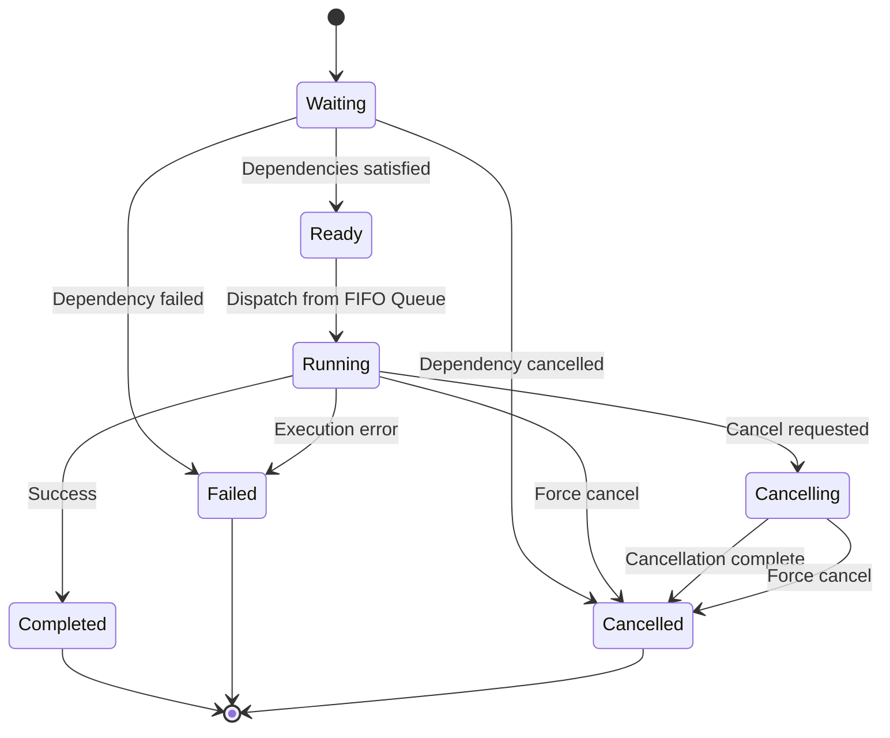

# TWF Rust Port - Design Specification

## Overview

This document provides the detailed design specification for the Rust port of TWF (Two-pane Window Filer), following the single AppState architectural pattern with structured decomposition. The design emphasizes data-oriented programming, clear state boundaries, and idiomatic Rust patterns.

## 1️⃣ System Architecture（確定版）

### 🔷 Architecture Principles

**1. FIFO Queue**

- 単純な FIFO キュー
- 依存評価なし（現状）
- Worker が空いたら次を dispatch
- 状態管理はしない

**2. WorkerPool**

- 固定数スレッド（起動時生成）
- デフォルト：4
- 起動後は変更不可
- Job を受け取り execute()

**3. Job**

- 実際のファイル I/O を実行
- 状態遷移を保持
- Cancellation フラグを監視
- FailureReason を保持

**4. LockTable**

- path → JobId
- 同一パスの同時操作を防止
- acquire / release のみ
- 複雑な階層ロックなし

## 2️⃣ Job State Machine（確定版）

### 🔷 State Definitions

| State | Meaning |
|-------|---------|
| Queued | FIFO Queue 内で待機 |
| Running | Worker が実行中 |
| Cancelling | キャンセル要求済み |
| Cancelled | 正常に中断 |
| Completed | 成功終了 |
| Failed | エラー終了 |

## 3️⃣ Cancellation Model（確定版）

**Cancel**

- UI ボタンあり
- cancel flag を立てる
- Worker が安全地点で停止
- 状態は Running → Cancelling → Cancelled

**Force Cancel**

- UI ボタンあり
- Worker に即終了要求
- 状態は Running → Cancelled
- 中間状態を表示しない
- 部分完了の可能性あり（仕様として許容）

## 4️⃣ LockTable Model（最小設計）

### Design Constraints

- 単一パス単位ロック
- ディレクトリ階層考慮しない
- ロック取得失敗時：Job は Failed に遷移、FailureReason::PathLocked

## 5️⃣ Scheduler Design（簡素化版）

- 優先度なし
- 依存なし
- リトライなし
- 単純で予測可能

## 6️⃣ Responsibility Separation（明文化）

| Component | Responsibility |
|-----------|----------------|
| UI | 表示・操作 |
| JobManager | キュー管理 |
| WorkerPool | 実行 |
| Job | I/O + 状態 |
| LockTable | パス競合防止 |

## 7️⃣ 非目的（明確化）

rwf は以下を目指さない：

- バッチ処理エンジン
- 複雑な DAG 依存評価
- ジョブ間通信
- 分散処理
- 優先度付きスケジューリング

rwf は：

> ユーザ操作起点のファイル操作を
> 単純・安全・予測可能に非同期実行する仕組み

## Core Data Structures

### AppState
Central application state that coordinates all components:

```rust
pub struct AppState {
    // Domain State
    pub filesystem: FilesystemModel,
    pub jobs: JobManager,
    pub search: SearchModel,
    pub marking: MarkingModel,
    pub history: NavigationHistory,
    
    // UI State
    pub ui: UIState,
    pub dialogs: DialogStack,
    
    // Backend State (Pure Data, No Handles)
    pub backends: BackendStatus,
    
    // Configuration
    pub config: AppConfig,
}
```

### FilesystemModel
Manages filesystem state for both panes:

```rust
pub struct FilesystemModel {
    pub left_pane: PaneModel,
    pub right_pane: PaneModel,
    pub cache: DirectoryCache,
}

pub struct PaneModel {
    pub current_location: Location,
    pub entries: Vec<FileEntry>,
    pub sort_mode: SortMode,
    pub display_mode: DisplayMode,
    pub file_mask: String,
}

pub enum Location {
    Local(PathBuf),
    Ssh { host: String, path: PathBuf },
    Cloud { provider: String, path: PathBuf },
    Archive { archive_path: PathBuf, inner_path: PathBuf },
}

#[derive(Clone)]
pub struct FileEntry {
    pub name: String,
    pub location: Location,
    pub size: u64,
    pub is_dir: bool,
    pub is_hidden: bool,
    pub modified: SystemTime,
    pub marked: bool,
}

pub struct DirectoryCache {
    pub entries: HashMap<Location, CachedDirectory>,
    pub ttl: Duration,
}

impl DirectoryCache {
    pub fn new() -> Self {
        Self {
            entries: HashMap::new(),
            ttl: Duration::from_secs(30), // Configurable duration
        }
    }
}

const DEFAULT_CACHE_TTL: Duration = Duration::from_secs(30);

pub struct CachedDirectory {
    pub entries: Vec<FileEntry>,
    pub timestamp: Instant,
    pub checksum: u64,
}
```

### JobManager
Manages background job state:

```rust
pub struct RunningJob {
    pub handle: JoinHandle<()>,
    pub cancel_token: CancellationToken,
}

use std::collections::BinaryHeap;
use std::cmp::Ordering;

#[derive(Eq, PartialEq)]
pub struct PrioritizedJob {
    pub spec: JobSpec,
}

impl Ord for PrioritizedJob {
    fn cmp(&self, other: &Self) -> Ordering {
        self.spec.priority
            .cmp(&other.spec.priority)
            .then_with(|| other.spec.created_at.cmp(&self.spec.created_at))
    }
}

impl PartialOrd for PrioritizedJob {
    fn partial_cmp(&self, other: &Self) -> Option<Ordering> {
        Some(self.cmp(other))
    }
}

pub struct JobManager {
    pub queue: BinaryHeap<PrioritizedJob>,
    pub active: HashMap<JobId, Job>,
    pub runtime: HashMap<JobId, RunningJob>,
    pub completed: HashMap<JobId, JobResult>,
    pub waiting: HashMap<JobId, JobSpec>,
    pub max_parallel: usize,
}

impl JobManager {
    pub fn request_cancel(&mut self, job_id: JobId) -> bool {
        // Cancel token in active job and set to Cancelling state
        if let Some(job) = self.active.get_mut(&job_id) {
            job.cancel_token.cancel();
            job.state = ExecutionState::Cancelling;
            return true;
        }

        // Cancel token in queued job
        let mut temp_queue = BinaryHeap::new();
        let mut found = false;
        
        while let Some(prioritized_job) = self.queue.pop() {
            if prioritized_job.spec.id == job_id {
                prioritized_job.spec.cancel_token.cancel();
                found = true;
            } else {
                temp_queue.push(prioritized_job);
            }
        }
        
        // Put back the remaining jobs
        self.queue = temp_queue;

        // Also check waiting jobs
        if let Some(waiting_job) = self.waiting.get(&job_id) {
            waiting_job.cancel_token.cancel();
            self.waiting.remove(&job_id);
            return true;
        }

        found
    }

    pub fn acknowledge_cancel(&mut self, job_id: JobId) -> Option<JobResult> {
        // Remove from active and runtime
        let job_result = self.active.remove(&job_id).map(|job| {
            JobResult::Cancelled(CancelReason::ByUser)
        });

        // Also remove from runtime handles
        self.runtime.remove(&job_id);

        job_result
    }
    
    pub fn start_job(&mut self, job_spec: JobSpec, handle: JoinHandle<()>) {
        let job_runtime = RunningJob {
            handle,
            cancel_token: job_spec.cancel_token.clone(),
        };
        self.runtime.insert(job_spec.id, job_runtime);
    }
    
    pub fn complete_job(&mut self, job_id: JobId) {
        // Remove from runtime handles when job completes
        self.runtime.remove(&job_id);
    }
    
    pub fn enqueue_job(&mut self, job_spec: JobSpec) {
        if job_spec.depends_on.is_empty() {
            // No dependencies, add to queue
            self.queue.push(PrioritizedJob { spec: job_spec });
        } else {
            // Has dependencies, add to waiting
            self.waiting.insert(job_spec.id, job_spec);
        }
    }
    
    pub fn check_dependencies(&mut self) {
        let mut satisfied_deps = Vec::new();
        
        // Check which waiting jobs can now be queued
        for (job_id, job_spec) in &self.waiting {
            let all_satisfied = job_spec.depends_on.iter()
                .all(|dep_id| self.completed.iter().any(|result| result.id == *dep_id));
            
            if all_satisfied {
                satisfied_deps.push(*job_id);
            }
        }
        
        // Move satisfied jobs from waiting to queue
        for job_id in satisfied_deps {
            if let Some(job_spec) = self.waiting.remove(&job_id) {
                self.queue.push(PrioritizedJob { spec: job_spec });
            }
        }
    }
}

#[derive(Debug, Clone)]
pub enum JobKind {
    Copy { sources: Vec<Location>, dest: Location },
    Move { sources: Vec<Location>, dest: Location },
    Delete { targets: Vec<Location> },
    Mkdir { location: Location },
    Rename { from: Location, to: Location },
}

use tokio_util::sync::CancellationToken;

#[derive(Debug, Clone)]
pub struct JobSpec {
    pub id: JobId,
    pub kind: JobKind,
    pub created_at: SystemTime,
    pub priority: u8,
    pub cancel_token: CancellationToken,
    pub retry_policy: Option<RetryPolicy>,
    pub depends_on: Vec<JobId>,
}

impl JobSpec {
    pub fn new(kind: JobKind) -> Self {
        Self {
            id: JobId::new(),
            kind,
            created_at: SystemTime::now(),
            priority: 1,
            cancel_token: CancellationToken::new(),
            retry_policy: None,
            depends_on: Vec::new(),
        }
    }
    
    pub fn with_retry_policy(mut self, policy: RetryPolicy) -> Self {
        self.retry_policy = Some(policy);
        self
    }
    
    pub fn with_dependencies(mut self, deps: Vec<JobId>) -> Self {
        self.depends_on = deps;
        self
    }
    
    pub fn effective_priority(&self) -> u8 {
        let elapsed = SystemTime::now()
            .duration_since(self.created_at)
            .unwrap_or(Duration::from_secs(0));
        
        let aging_bonus = (elapsed.as_secs() / 10) as u8; // +1 priority every 10 seconds
        self.priority.saturating_add(aging_bonus)
    }
}

#[derive(Debug, Clone)]
pub struct RetryPolicy {
    pub max_retries: u8,
    pub backoff: Duration,
    pub exponential: bool,
}

#[derive(Debug, Clone)]
pub struct Job {
    pub spec: JobSpec,
    pub state: ExecutionState,
    pub result: Option<JobResult>,
}

#[derive(Debug, Clone)]
pub struct JobResult {
    pub id: JobId,
    pub kind: JobKind,
    pub completed_at: SystemTime,
    pub result: OpResult,
}

#[derive(Debug, Clone, Copy, PartialEq)]
pub enum ExecutionState {
    Waiting,      // 依存未解決
    Ready,        // 実行可能
    Running,
    Cancelling,   // キャンセル要求中
    Completed,
    Failed,
    Cancelled,
}
```

### SearchModel
Manages search state:

```rust
pub struct SearchModel {
    pub query: String,
    pub results: Vec<FileEntry>,
    pub history: Vec<String>,
    pub current_index: Option<usize>,
    pub case_sensitive: bool,
    pub use_regex: bool,
}
```

### MarkingModel
Manages file marking state:

```rust
pub struct MarkingModel {
    pub marked_locations: HashSet<Location>,
    pub marked_count: usize,
    pub marked_size: u64,
}
```

### NavigationHistory
Manages navigation history:

```rust
pub struct NavigationHistory {
    pub left_stack: Vec<Location>,
    pub right_stack: Vec<Location>,
    pub left_pos: usize,
    pub right_pos: usize,
}
```

### UIState
Manages UI state:

```rust
pub struct UIState {
    pub active_pane: ActivePane,
    pub selection: SelectionState,
    pub scroll: ScrollState,
    pub mode: UIMode,
    pub layout: LayoutState,
}

pub struct SelectionState {
    pub left_cursor: usize,
    pub right_cursor: usize,
    pub visual_start: Option<usize>,
}

pub struct ScrollState {
    pub left_offset: usize,
    pub right_offset: usize,
}

pub struct LayoutState {
    pub pane_split_ratio: f64,
    pub show_status_bar: bool,
    pub show_task_panel: bool,
}

#[derive(Debug, Clone, Copy, PartialEq)]
pub enum ActivePane {
    Left,
    Right,
}

#[derive(Debug, Clone, Copy, PartialEq)]
pub enum UIMode {
    Normal,
    Visual,
    Search,
    Command,
    Dialog,
}
```

### DialogStack
Manages dialog state:

```rust
pub struct DialogStack {
    pub stack: Vec<Dialog>,
    pub input_buffer: String,
}

pub struct Dialog {
    pub title: String,
    pub content: DialogContent,
    pub pending_action: Option<PendingAction>,
}

#[derive(Debug, Clone)]
pub enum DialogContent {
    Confirmation { message: String },
    Input { prompt: String, default_value: String },
    FileOperation { operation: String, progress: Option<f64> },
    Search { query: String },
    Rename { current_name: String, new_name: String },
}

#[derive(Debug, Clone)]
pub enum PendingAction {
    ConfirmCopy { sources: Vec<Location>, destination: Location },
    ConfirmMove { sources: Vec<Location>, destination: Location },
    ConfirmDelete { locations: Vec<Location> },
    ExecuteRename { from: Location, to: Location },
    ExecuteSearch { query: String, location: Location },
}
```

### BackendStatus
Manages backend connection state (pure data):

```rust
pub struct BackendStatus {
    // Pure state about backend connections
    pub ssh_connections: HashMap<String, ConnectionStatus>,
    pub cloud_providers: HashMap<String, ProviderStatus>,
    pub archive_sessions: HashMap<PathBuf, ArchiveStatus>,
}

#[derive(Debug, Clone)]
pub enum ConnectionStatus {
    Connected,
    Connecting,
    Disconnected,
    Error(String),
}

#[derive(Debug, Clone)]
pub enum ProviderStatus {
    Authenticated,
    Authenticating,
    NeedsAuth,
    Error(String),
}

#[derive(Debug, Clone)]
pub enum ArchiveStatus {
    Open,
    Closed,
    Error(String),
}
```

### AppConfig
Manages application configuration:

```rust
#[derive(Serialize, Deserialize, Clone)]
pub struct AppConfig {
    pub display: DisplayConfig,
    pub key_bindings: KeyBindings,
    pub file_operations: FileOpConfig,
    pub search: SearchConfig,
    pub ui: UIConfig,
}

#[derive(Serialize, Deserialize, Clone)]
pub struct DisplayConfig {
    pub colors: ColorScheme,
    pub show_hidden: bool,
    pub show_system: bool,
    pub refresh_interval: u64, // milliseconds
    pub cjk_width: u8,
}

#[derive(Serialize, Deserialize, Clone)]
pub struct KeyBindings {
    pub normal_mode: HashMap<String, Vec<KeyCombination>>,
    pub visual_mode: HashMap<String, Vec<KeyCombination>>,
    pub search_mode: HashMap<String, Vec<KeyCombination>>,
    pub command_mode: HashMap<String, Vec<KeyCombination>>,
}
```

## State Update Result

```rust
pub struct StateUpdateResult {
    pub started_jobs: Vec<JobSpec>,
    pub completed_jobs: Vec<JobId>,
    pub cancelled_jobs: Vec<JobId>,
}
```

## State Transition System

### Transition Types
All state changes occur through explicit transitions:

```rust
#[derive(Debug, Clone)]
pub enum Transition {
    // Navigation
    ChangeLocation(ActivePane, Location),
    NavigateUp(ActivePane),
    NavigateDown(ActivePane, isize),
    SwitchPane,
    SwitchTab(usize),
    
    // Job Operations
    EnqueueJob(JobSpec),
    StartNextJob,
    UpdateJobProgress(JobId, f64),
    CompleteJob(JobId, OpResult),
    CancelJob(JobId),
    CancelAcknowledged(JobId),
    
    // View Operations
    ChangeSortMode(ActivePane, SortMode),
    ChangeDisplayMode(ActivePane, DisplayMode),
    ToggleMarkLocation(Location),
    MarkAll,
    UnmarkAll,
    
    // Search Operations
    StartSearch(String),
    UpdateSearchResults { query: String, results: Vec<FileEntry> },
    NavigateSearchResults(isize),
    
    // UI Operations
    ChangeUIMode(UIMode),
    ShowDialog(Dialog),
    CloseDialog,
    ProcessDialogResponse(bool),
    
    // Configuration
    UpdateConfig(AppConfig),
    
    // Backend Operations
    ConnectSSH(String, SSHCredentials),
    DisconnectSSH(String),
    ConnectCloud(String, CloudCredentials),
    
    // Application Control
    QuitApplication,
}
```

### State Update Function
The core state transformation function:

```rust
pub fn update_state(state: &mut AppState, transition: Transition) -> StateUpdateResult {
    match transition {
        Transition::NavigateDown(pane, delta) => {
            let (cursor, entries) = match pane {
                ActivePane::Left => (
                    &mut state.ui.selection.left_cursor,
                    &state.filesystem.left_pane.entries,
                ),
                ActivePane::Right => (
                    &mut state.ui.selection.right_cursor,
                    &state.filesystem.right_pane.entries,
                ),
            };

            if !entries.is_empty() {
                let new_cursor = (*cursor as isize + delta).max(0).min(entries.len() as isize - 1) as usize;
                *cursor = new_cursor;
            }
            
            StateUpdateResult {
                started_jobs: vec![],
                completed_jobs: vec![],
                cancelled_jobs: vec![],
            }
        }
        
        Transition::SwitchPane => {
            state.ui.active_pane = match state.ui.active_pane {
                ActivePane::Left => ActivePane::Right,
                ActivePane::Right => ActivePane::Left,
            };
            
            StateUpdateResult {
                started_jobs: vec![],
                completed_jobs: vec![],
                cancelled_jobs: vec![],
            }
        }
        
        Transition::ChangeLocation(pane, location) => {
            match pane {
                ActivePane::Left => {
                    // Update history
                    state.history.left_stack.truncate(state.history.left_pos + 1);
                    state.history.left_stack.push(state.filesystem.left_pane.current_location.clone());
                    state.history.left_pos = state.history.left_stack.len() - 1;
                    
                    state.filesystem.left_pane.current_location = location;
                }
                ActivePane::Right => {
                    state.history.right_stack.truncate(state.history.right_pos + 1);
                    state.history.right_stack.push(state.filesystem.right_pane.current_location.clone());
                    state.history.right_pos = state.history.right_stack.len() - 1;
                    
                    state.filesystem.right_pane.current_location = location;
                }
            }
            
            StateUpdateResult {
                started_jobs: vec![],
                completed_jobs: vec![],
                cancelled_jobs: vec![],
            }
        }
        
        Transition::ToggleMarkLocation(location) => {
            if state.marking.marked_locations.contains(&location) {
                state.marking.marked_locations.remove(&location);
            } else {
                state.marking.marked_locations.insert(location);
            }
            
            update_marking_aggregates(state);
            
            StateUpdateResult {
                started_jobs: vec![],
                completed_jobs: vec![],
                cancelled_jobs: vec![],
            }
        }
        
        Transition::MarkAll => {
            let entries = match state.ui.active_pane {
                ActivePane::Left => &state.filesystem.left_pane.entries,
                ActivePane::Right => &state.filesystem.right_pane.entries,
            };
            
            // Mark all entries in current pane
            for entry in entries {
                state.marking.marked_locations.insert(entry.location.clone());
            }
            
            update_marked_entries(state);
            update_marking_aggregates(state);
            
            StateUpdateResult {
                started_jobs: vec![],
                completed_jobs: vec![],
                cancelled_jobs: vec![],
            }
        }
        
        Transition::UnmarkAll => {
            let current_location = state.current_location().clone();
            // Remove all marked locations that are in current directory
            state.marking.marked_locations.retain(|loc| !is_same_or_subdir(loc, &current_location));
            update_marked_entries(state);
            update_marking_aggregates(state);
            
            StateUpdateResult {
                started_jobs: vec![],
                completed_jobs: vec![],
                cancelled_jobs: vec![],
            }
        }
        
        Transition::EnqueueJob(job_spec) => {
            state.jobs.queue.push(PrioritizedJob { spec: job_spec });

            StateUpdateResult {
                started_jobs: vec![],
                completed_jobs: vec![],
                cancelled_jobs: vec![],
            }
        }
        
        Transition::StartNextJob => {
            if state.jobs.active.len() < state.jobs.max_parallel {
                if let Some(prioritized_job) = state.jobs.queue.pop() {
                    let job_spec = prioritized_job.spec;
                    // Add to active jobs
                    let job = Job {
                        spec: job_spec.clone(),
                        state: ExecutionState::Running,
                        result: None,
                    };
                    state.jobs.active.insert(job_spec.id, job);

                    return StateUpdateResult {
                        started_jobs: vec![job_spec],
                        completed_jobs: vec![],
                        cancelled_jobs: vec![],
                    };
                }
            }

            StateUpdateResult {
                started_jobs: vec![],
                completed_jobs: vec![],
                cancelled_jobs: vec![],
            }
        }
        
        Transition::UpdateJobProgress(job_id, progress) => {
            if let Some(job) = state.jobs.active.get_mut(&job_id) {
                job.progress = progress;
                // Keep current state, don't change it during progress updates
            }
            
            StateUpdateResult {
                started_jobs: vec![],
                completed_jobs: vec![],
                cancelled_jobs: vec![],
            }
        }

        Transition::CompleteJob(job_id, result) => {
            let job_result = match state.jobs.active.get(&job_id).map(|job| job.state) {
                Some(ExecutionState::Cancelling) => JobResult::Cancelled(CancelReason::ByUser),
                _ => {
                    if result.is_ok() {
                        JobResult::Completed
                    } else {
                        JobResult::Failed(FailureReason::InternalError("Operation failed".to_string()))
                    }
                }
            };

            // Use the finish_job function to handle completion and dependency resolution
            state.jobs.finish_job(job_id, job_result);

            StateUpdateResult {
                started_jobs: vec![],
                completed_jobs: vec![job_id],
                cancelled_jobs: vec![],
            }
        }
        
        Transition::CancelJob(job_id) => {
            let mut cancelled = false;

            // Active job → signal only and set to Cancelling state
            if let Some(job) = state.jobs.active.get_mut(&job_id) {
                job.spec.cancel_token.cancel();
                job.state = ExecutionState::Cancelling;
                cancelled = true;
            }

            // Queue job → 即削除OK
            // Convert BinaryHeap to Vec to find and remove specific job
            let mut temp_queue = BinaryHeap::new();
            let mut found = false;
            
            while let Some(prioritized_job) = state.jobs.queue.pop() {
                if prioritized_job.spec.id == job_id {
                    prioritized_job.spec.cancel_token.cancel();
                    found = true;
                    cancelled = true;
                } else {
                    temp_queue.push(prioritized_job);
                }
            }
            
            // Put back the remaining jobs
            state.jobs.queue = temp_queue;

            StateUpdateResult {
                started_jobs: vec![],
                completed_jobs: vec![],
                cancelled_jobs: if cancelled { vec![job_id] } else { vec![] },
            }
        }
        
        Transition::CancelAcknowledged(job_id) => {
            if let Some(job_result) = state.jobs.acknowledge_cancel(job_id) {
                state.jobs.completed.push_back(job_result);
            }

            StateUpdateResult {
                started_jobs: vec![],
                completed_jobs: vec![job_id],
                cancelled_jobs: vec![],
            }
        }

        Transition::UpdateSearchResults { query, results } => {
            state.search.query = query;
            state.search.results = results;
            
            StateUpdateResult {
                started_jobs: vec![],
                completed_jobs: vec![],
                cancelled_jobs: vec![],
            }
        }

        // Additional transition handlers...
    }
}
```

### Helper Functions
```rust
fn update_marking_aggregates(state: &mut AppState) {
    state.marking.marked_count = state.marking.marked_locations.len();

    // Calculate total size of marked files
    state.marking.marked_size = 0;
    // This would iterate through marked locations and sum their sizes
}

fn is_same_or_subdir(location: &Location, parent: &Location) -> bool {
    match (location, parent) {
        (Location::Local(loc_path), Location::Local(parent_path)) => {
            loc_path.starts_with(parent_path)
        }
        _ => false, // TODO: Extend for SSH/Cloud/Archive when implemented
    }
}

fn update_marked_entries(state: &mut AppState) {
    for entry in &mut state.filesystem.left_pane.entries {
        entry.marked = state.marking.marked_locations.contains(&entry.location);
    }
    
    for entry in &mut state.filesystem.right_pane.entries {
        entry.marked = state.marking.marked_locations.contains(&entry.location);
    }
}
```

## Component Designs

### Input Processing
Pure functions that map events to state transitions:

```rust
pub fn handle_input(app_state: &AppState, event: KeyEvent) -> Vec<Transition> {
    match app_state.ui.mode {
        UIMode::Normal => handle_normal_mode(app_state, event),
        UIMode::Search => handle_search_mode(app_state, event),
        UIMode::Visual => handle_visual_mode(app_state, event),
        UIMode::Command => handle_command_mode(app_state, event),
        UIMode::Dialog => handle_dialog_mode(app_state, event),
    }
}

fn handle_normal_mode(app_state: &AppState, event: KeyEvent) -> Vec<Transition> {
    match event.code {
        KeyCode::Up | KeyCode::Char('k') => vec![Transition::NavigateDown(app_state.ui.active_pane, -1)],
        KeyCode::Down | KeyCode::Char('j') => vec![Transition::NavigateDown(app_state.ui.active_pane, 1)],
        KeyCode::Left | KeyCode::Char('h') => vec![Transition::SwitchPane],
        KeyCode::Right | KeyCode::Char('l') => {
            if let Some(selected) = get_current_selection(app_state) {
                if selected.is_dir {
                    vec![Transition::ChangeLocation(
                        app_state.ui.active_pane,
                        selected.location.clone()
                    )]
                } else {
                    vec![]
                }
            } else {
                vec![]
            }
        }
        // Example of job enqueueing in input handler
        KeyCode::Char('c') => {
            // This would be triggered by a copy operation
            if let Some(selected) = get_current_selection(app_state) {
                // In practice, this would open a dialog to select destination
                // For now, we'll create a dummy copy job
                let job_spec = JobSpec::new(JobKind::Copy {
                    sources: vec![selected.location.clone()],
                    dest: Location::Local(std::env::current_dir().unwrap_or_default()),
                });
                vec![Transition::EnqueueJob(job_spec)]
            } else {
                vec![]
            }
        }
        // Additional key bindings...
        _ => vec![],
    }
}
```

### File Operation Orchestration
State machine for managing file operations:

```rust
pub fn start_copy_operation(app_state: &AppState, sources: &[Location], dest: &Location) -> Vec<Transition> {
    let job_spec = JobSpec::new(JobKind::Copy {
        sources: sources.to_vec(),
        dest: dest.clone(),
    });
    
    vec![Transition::EnqueueJob(job_spec)]
}
```

### Search and Filtering
Efficient search implementation:

```rust
pub fn execute_search(app_state: &AppState, query: &str) -> Vec<Transition> {
    let current_location = match app_state.ui.active_pane {
        ActivePane::Left => &app_state.filesystem.left_pane.current_location,
        ActivePane::Right => &app_state.filesystem.right_pane.current_location,
    };
    
    // This would trigger a search operation through the appropriate backend
    vec![Transition::StartSearch(query.to_string())]
}
```

## Side Effect Adapters

### Filesystem Backend Trait
Abstract trait for different backend types:

```rust
#[async_trait]
pub trait FilesystemBackend {
    async fn read_directory(&self, location: &Location) -> Result<Vec<FileEntry>, FsError>;
    async fn copy_files(&self, sources: &[Location], dest: &Location) -> Result<(), FsError>;
    async fn move_files(&self, sources: &[Location], dest: &Location) -> Result<(), FsError>;
    async fn delete_files(&self, locations: &[Location]) -> Result<(), FsError>;
    async fn create_directory(&self, location: &Location) -> Result<(), FsError>;
    async fn rename_file(&self, from: &Location, to: &Location) -> Result<(), FsError>;
}

pub struct LocalFilesystemBackend;

#[async_trait]
impl FilesystemBackend for LocalFilesystemBackend {
    async fn read_directory(&self, location: &Location) -> Result<Vec<FileEntry>, FsError> {
        match location {
            Location::Local(path) => {
                let mut entries = Vec::new();
                
                for entry in std::fs::read_dir(path)? {
                    let entry = entry?;
                    let metadata = entry.metadata()?;
                    
                    let file_entry = FileEntry {
                        name: entry.file_name().to_string_lossy().to_string(),
                        location: Location::Local(entry.path()),
                        size: metadata.len(),
                        is_dir: metadata.file_type().is_dir(),
                        is_hidden: is_hidden(&entry.path()),
                        modified: metadata.modified().unwrap_or_else(|_| SystemTime::now()),
                        marked: false,
                    };
                    
                    entries.push(file_entry);
                }
                
                Ok(entries)
            }
            _ => Err(FsError::InvalidBackend),
        }
    }
    
    // Other implementations...
    async fn copy_files(&self, sources: &[Location], dest: &Location) -> Result<(), FsError> {
        // Local filesystem implementation
        Ok(())
    }
    
    async fn move_files(&self, sources: &[Location], dest: &Location) -> Result<(), FsError> {
        // Local filesystem implementation
        Ok(())
    }
    
    async fn delete_files(&self, locations: &[Location]) -> Result<(), FsError> {
        // Local filesystem implementation
        Ok(())
    }
    
    async fn create_directory(&self, location: &Location) -> Result<(), FsError> {
        // Local filesystem implementation
        Ok(())
    }
    
    async fn rename_file(&self, from: &Location, to: &Location) -> Result<(), FsError> {
        // Local filesystem implementation
        Ok(())
    }
}
```

### Terminal Adapter
Handles terminal I/O:

```rust
pub struct TerminalAdapter {
    terminal: Terminal<CrosstermBackend<Stdout>>,
}

impl TerminalAdapter {
    pub fn new() -> Result<Self, TermError> {
        let stdout = std::io::stdout();
        let backend = CrosstermBackend::new(stdout);
        let terminal = Terminal::new(backend)?;
        
        Ok(TerminalAdapter { terminal })
    }
    
    pub fn render(&mut self, app_state: &AppState) -> Result<(), RenderError> {
        self.terminal.draw(|f| {
            render_main_layout(f, app_state);
        })?;
        
        Ok(())
    }
    
    pub fn poll_event(&self) -> Result<Option<Event>, TermError> {
        if crossterm::event::poll(std::time::Duration::from_millis(16))? {
            Ok(Some(crossterm::event::read()?))
        } else {
            Ok(None)
        }
    }
}
```

### Background Executor
Manages background operations:

```rust
pub struct BackgroundExecutor {
    event_sender: Sender<AppEvent>,
}

impl BackgroundExecutor {
    pub fn new(event_sender: Sender<AppEvent>) -> Self {
        Self { event_sender }
    }
    
    pub fn execute_job(&self, job_spec: JobSpec) -> JoinHandle<()> {
        let sender = self.event_sender.clone();
        let job_id = job_spec.id; // Use the ID from the JobSpec
        let cancel_token = job_spec.cancel_token.clone();
        
        tokio::spawn(async move {
            // Execute the job based on its kind with cancellation support
            tokio::select! {
                result = async {
                    match &job_spec.kind {
                        JobKind::Copy { sources, dest } => {
                            perform_copy_operation_with_progress(sources.clone(), dest.clone(), cancel_token.clone(), |progress| {
                                sender.send(AppEvent::JobProgress { job_id, progress }).ok();
                            }).await
                        }
                        JobKind::Move { sources, dest } => {
                            perform_move_operation_with_progress(sources.clone(), dest.clone(), cancel_token.clone(), |progress| {
                                sender.send(AppEvent::JobProgress { job_id, progress }).ok();
                            }).await
                        }
                        JobKind::Delete { targets } => {
                            perform_delete_operation(targets.clone(), cancel_token.clone()).await
                        }
                        JobKind::Mkdir { location } => {
                            perform_mkdir_operation(location.clone(), cancel_token.clone()).await
                        }
                        JobKind::Rename { from, to } => {
                            perform_rename_operation(from.clone(), to.clone(), cancel_token.clone()).await
                        }
                    }
                } => {
                    // Send job completed event
                    sender.send(AppEvent::JobCompleted { job_id, result }).ok();
                },
                _ = cancel_token.cancelled() => {
                    // Send job cancelled event
                    sender.send(AppEvent::JobCancelled { job_id }).ok();
                }
            }
        })
    }
    
    pub async fn run_job(
        &self,
        job_spec: JobSpec,
        cancel_token: CancellationToken,
        sender: Sender<AppEvent>,
    ) {
        let job_id = job_spec.id;
        
        // Execute the job based on its kind with cancellation support
        tokio::select! {
            result = async {
                match &job_spec.kind {
                    JobKind::Copy { sources, dest } => {
                        perform_copy_operation_with_progress(sources.clone(), dest.clone(), cancel_token.clone(), |progress| {
                            sender.send(AppEvent::JobProgress { job_id, progress }).ok();
                        }).await
                    }
                    JobKind::Move { sources, dest } => {
                        perform_move_operation_with_progress(sources.clone(), dest.clone(), cancel_token.clone(), |progress| {
                            sender.send(AppEvent::JobProgress { job_id, progress }).ok();
                        }).await
                    }
                    JobKind::Delete { targets } => {
                        perform_delete_operation(targets.clone(), cancel_token.clone()).await
                    }
                    JobKind::Mkdir { location } => {
                        perform_mkdir_operation(location.clone(), cancel_token.clone()).await
                    }
                    JobKind::Rename { from, to } => {
                        perform_rename_operation(from.clone(), to.clone(), cancel_token.clone()).await
                    }
                }
            } => {
                // Send job completed event
                sender.send(AppEvent::JobCompleted { job_id, result }).ok();
            },
            _ = cancel_token.cancelled() => {
                // Send job cancelled event
                sender.send(AppEvent::JobCancelled { job_id }).ok();
            }
        }
    }
}
```

## Runtime Context and Event System

### Runtime Context
Separate structure holding runtime resources and communication channels:

```rust
pub struct RuntimeContext {
    pub event_sender: Sender<AppEvent>,
    pub event_receiver: Receiver<AppEvent>,
    pub backends: BackendRuntime,
    // job_handles are now managed in JobManager
}

pub struct BackendRuntime {
    pub filesystem: Box<dyn FilesystemBackend>,
    pub ssh_sessions: HashMap<String, SSHTunnel>,
    pub cloud_providers: CloudProviders,
    pub archive_handles: HashMap<PathBuf, ArchiveHandle>,
}

pub struct JobRuntimeHandles {
    pub handles: HashMap<JobId, JoinHandle<OpResult>>,
}

impl RuntimeContext {
    pub fn new(event_sender: Sender<AppEvent>) -> Self {
        let (sender, receiver) = std::sync::mpsc::channel();

        Self {
            event_sender,
            event_receiver: receiver,
            backends: BackendRuntime::new(),
        }
    }
}

impl BackendRuntime {
    pub fn new() -> Self {
        Self {
            filesystem: Box::new(LocalFilesystemBackend),
            ssh_sessions: HashMap::new(),
            cloud_providers: CloudProviders::new(),
            archive_handles: HashMap::new(),
        }
    }
}

impl JobRuntimeHandles {
    pub fn new() -> Self {
        Self {
            handles: HashMap::new(),
        }
    }
}

#[derive(Debug)]
pub enum AppEvent {
    JobProgress { job_id: JobId, progress: f64 },
    JobCompleted { job_id: JobId, result: OpResult },
    JobCancelled { job_id: JobId },
    SearchCompleted { query: String, results: Vec<FileEntry> },
    ErrorOccurred { message: String },
}

pub type OpResult = Result<(), String>;

pub struct SSHTunnel {
    // SSH connection details
}

pub struct CloudProviders {
    // Cloud provider implementations
}

impl CloudProviders {
    pub fn new() -> Self {
        Self {}
    }
}

pub struct ArchiveHandle {
    // Archive handle details
}

pub type JobId = u64;

use std::sync::atomic::{AtomicU64, Ordering};

static JOB_ID_COUNTER: AtomicU64 = AtomicU64::new(1);

impl JobId {
    pub fn new() -> Self {
        JOB_ID_COUNTER.fetch_add(1, Ordering::SeqCst)
    }
}

pub async fn perform_copy_operation_with_progress(
    sources: Vec<Location>,
    dest: Location,
    cancel_token: CancellationToken,
    progress_cb: impl Fn(f64),
) -> OpResult {
    let total = sources.len();
    for (i, src) in sources.into_iter().enumerate() {
        tokio::select! {
            _ = cancel_token.cancelled() => {
                return Err("Cancelled".into());
            }
            result = copy_one_file(src, &dest) => {
                result?;
            }
        }
        
        progress_cb(i as f64 / total as f64);
    }
    
    Ok(())
}

pub async fn perform_move_operation_with_progress(
    sources: Vec<Location>,
    dest: Location,
    cancel_token: CancellationToken,
    progress_cb: impl Fn(f64),
) -> OpResult {
    let total = sources.len();
    for (i, src) in sources.into_iter().enumerate() {
        tokio::select! {
            _ = cancel_token.cancelled() => {
                return Err("Cancelled".into());
            }
            result = move_one_file(src, &dest) => {
                result?;
            }
        }
        
        progress_cb(i as f64 / total as f64);
    }
    
    Ok(())
}

pub async fn perform_delete_operation(
    targets: Vec<Location>,
    cancel_token: CancellationToken,
) -> OpResult {
    for target in targets {
        tokio::select! {
            _ = cancel_token.cancelled() => {
                return Err("Cancelled".into());
            }
            result = delete_one_item(target) => {
                result?;
            }
        }
    }
    
    Ok(())
}

pub async fn perform_mkdir_operation(
    location: Location,
    cancel_token: CancellationToken,
) -> OpResult {
    tokio::select! {
        _ = cancel_token.cancelled() => {
            return Err("Cancelled".into());
        }
        result = create_directory(location) => {
            result?;
        }
    }
    
    Ok(())
}

pub async fn perform_rename_operation(
    from: Location,
    to: Location,
    cancel_token: CancellationToken,
) -> OpResult {
    tokio::select! {
        _ = cancel_token.cancelled() => {
            return Err("Cancelled".into());
        }
        result = rename_item(from, to) => {
            result?;
        }
    }
    
    Ok(())
}

async fn copy_one_file(src: Location, dest: &Location) -> OpResult {
    // Implementation for copying a single file
    Ok(())
}

async fn move_one_file(src: Location, dest: &Location) -> OpResult {
    // Implementation for moving a single file
    Ok(())
}

async fn delete_one_item(target: Location) -> OpResult {
    // Implementation for deleting a single item
    Ok(())
}

async fn create_directory(location: Location) -> OpResult {
    // Implementation for creating a directory
    Ok(())
}

async fn rename_item(from: Location, to: Location) -> OpResult {
    // Implementation for renaming an item
    Ok(())
}
```

### Event System Design
- Transition represents user-driven state changes.
- AppEvent represents side-effect driven asynchronous updates.
- Clear separation between synchronous user actions and asynchronous background operations.
- Events flow from background tasks to main state loop through channels.

## UI Integration: Job Visualization

### Projection Model
The UI layer does not render JobRuntimeState directly.
Instead, it uses a derived JobView model:

```rust
pub struct JobView {
    pub id: JobId,
    pub name: String,
    pub state: ExecutionState,
    pub progress: f64,
    pub size_info: String,
    pub eta: Option<String>,
    pub can_cancel: bool,
    pub is_removable: bool,
}

pub enum JobViewSource<'a> {
    Active(&'a Job),
    Completed(&'a JobResult),
}

impl<'a> From<JobViewSource<'a>> for JobView {
    fn from(source: JobViewSource<'a>) -> Self {
        match source {
            JobViewSource::Active(job) => {
                let can_cancel = matches!(job.state, ExecutionState::Running);

                JobView {
                    id: job.spec.id,
                    name: format_job_name(&job.spec.kind),
                    state: job.state,
                    progress: 0.0, // Progress is now handled differently
                    size_info: "".to_string(), // Simplified for now
                    eta: None, // ETA is calculated differently
                    can_cancel,
                    is_removable: false, // Active jobs are not removable until completed
                }
            }
            JobViewSource::Completed(result) => {
                JobView {
                    id: result.id,
                    name: format_job_name(&result.kind),
                    state: ExecutionState::Completed, // Completed jobs show completed state
                    progress: 1.0, // Completed jobs show 100% progress
                    size_info: "".to_string(), // No size info for completed jobs
                    eta: None, // No ETA for completed jobs
                    can_cancel: false, // Cannot cancel completed jobs
                    is_removable: true, // Completed jobs can be removed from view
                }
            }
        }
    }
}
```

### Rendering Rules
- **Running** → Show progress with percentage and file details
- **Cancelling** → Show "Cancelling..." text with frozen progress (no updates)
- **Cancelled** → Show ✕ mark with "Cancelled" status
- **Completed** → Show ✓ mark with "Completed" status  
- **Failed** → Show ! mark with error message

### Interaction Rules
- **Cancel button** is enabled only in `Running` state
- **Cancelling state** disables further cancellation (button becomes disabled)
- **Removal from active list** happens only after `CancelAcknowledged` transition
- **Progress updates** continue during `Cancelling` state until operation completes

### State Transition Visualization
```
Running ──(Cancel)──→ Cancelling ──(Complete)──→ Cancelled
   ↓                    ↓                        ↓
[Cancel]           [Cancelling...]           [✕ Cancelled]
   ↑                    ↑                        ↑
Enabled            Disabled                 Removed
```

### Job Panel Implementation
The UI renders a job panel that shows all active jobs with their current state:

```rust
pub struct JobPanel {
    pub jobs: Vec<JobView>,
    pub show_completed: bool,
    pub selected_job: Option<JobId>,
}

impl JobPanel {
    pub fn render(&self, area: Rect, buf: &mut Buffer) {
        // Render job list with appropriate styling based on state
        for job_view in &self.jobs {
            match job_view.state {
                ExecutionState::Running => {
                    // Render with progress bar and cancel button
                    self.render_running_job(job_view, area, buf);
                }
                ExecutionState::Cancelling => {
                    // Render with "Cancelling..." indicator and disabled controls
                    self.render_cancelling_job(job_view, area, buf);
                }
                ExecutionState::Cancelled => {
                    // Render with "Cancelled" status and remove option
                    self.render_cancelled_job(job_view, area, buf);
                }
                ExecutionState::Completed => {
                    // Render with "Completed" status and remove option
                    self.render_completed_job(job_view, area, buf);
                }
                ExecutionState::Failed => {
                    // Render with "Failed" status and error details
                    self.render_failed_job(job_view, area, buf);
                }
                ExecutionState::Waiting => {
                    // Render with "Queued" status
                    self.render_queued_job(job_view, area, buf);
                }
            }
        }
    }
}
```

This projection approach ensures that the UI layer remains pure and decoupled from the internal state representation, while providing clear visual feedback for all job states including the important `Cancelling` intermediate state.

## UI Cancellation Policy

### Visual State Representation
The UI clearly distinguishes between different job states with appropriate visual indicators:

| State | Display |
|-------|---------|
| Running | Spinner animation with percentage `[42%] Copy foo.txt (23/150)` |
| Cancelling | "Cancelling..." indicator with frozen progress `[Cancelling...] Move bar/ (45/200)` |
| Cancelled | Greyed out with "Cancelled" status `[Cancelled] Delete tmp/` |
| Failed | Red text with error indicator `[FAILED] Copy error.txt` |
| Completed | Green text with "Completed" status `[Completed] Archive done.zip` |

### Input Handling Policy
Cancellation is handled with clear state-based restrictions:

```rust
// In input handler
match event {
    // ... other events
    KeyEvent::Char('c') if is_cancel_key(event) => {
        if let Some(selected_job_id) = get_selected_job_id() {
            if let Some(job) = app_state.jobs.active.get(&selected_job_id) {
                // Only allow cancellation for running jobs
                if job.state == ExecutionState::Running {
                    return vec![Transition::CancelJob(selected_job_id)];
                }
                // Cancelling jobs cannot be cancelled again
                // Waiting jobs can be cancelled immediately
                else if job.state == ExecutionState::Waiting {
                    return vec![Transition::CancelJob(selected_job_id)];
                }
            }
        }
    }
}
```

### UI Component Integration

#### Job Panel Structure
The job panel follows a clear 3-part layout:

```
┌ Background Jobs ────────────────┐
│ No active jobs                  │  ← Job List (visual states)
│                                  │
│ Selected Job Details:           │  ← Job Details (based on selection)
│ No job selected                 │
│                                  │
│            [ Close ] [ Cancel ] │  ← Action Buttons (state-dependent)
└──────────────────────────────────┘
```

#### Selection Rules
- **Persistence**: Selection persists even when job state changes
- **Automatic Updates**: If selected job completes, details panel updates automatically
- **Graceful Movement**: If selected job is removed, selection moves to next available job
- **State Awareness**: Action buttons change based on selected job's state

#### Job Panel Implementation
```rust
pub struct JobPanel {
    pub jobs: Vec<JobView>,
    pub show_completed: bool,
    pub selected_job: Option<JobId>,
}

impl JobPanel {
    pub fn render(&self, area: Rect, buf: &mut Buffer) {
        // Render job list with appropriate styling based on state
        for (idx, job_view) in self.jobs.iter().enumerate() {
            let is_selected = self.selected_job.map(|id| id == job_view.id).unwrap_or(false);

            match job_view.state {
                ExecutionState::Running => {
                    // Render with spinner and progress text
                    self.render_running_job(job_view, area, buf, is_selected);
                }
                ExecutionState::Cancelling => {
                    // Render with "Cancelling..." indicator and frozen progress
                    self.render_cancelling_job(job_view, area, buf, is_selected);
                }
                ExecutionState::Cancelled => {
                    // Render with "Cancelled" status and remove option
                    self.render_cancelled_job(job_view, area, buf, is_selected);
                }
                ExecutionState::Completed => {
                    // Render with "Completed" status and remove option
                    self.render_completed_job(job_view, area, buf, is_selected);
                }
                ExecutionState::Failed => {
                    // Render with "Failed" status and error details
                    self.render_failed_job(job_view, area, buf, is_selected);
                }
                ExecutionState::Waiting => {
                    // Render with "Queued" status and immediate cancel option
                    self.render_queued_job(job_view, area, buf, is_selected);
                }
            }
        }
    }
    
    fn render_running_job(&self, job: &JobView, area: Rect, buf: &mut Buffer, is_selected: bool) {
        // Show spinner animation (|, /, -, \) with percentage
        // Show file details with index (current/total)
        // Show bytes processed if available
        // Show enabled cancel button
    }
    
    fn render_cancelling_job(&self, job: &JobView, area: Rect, buf: &mut Buffer, is_selected: bool) {
        // Show "Cancelling..." text instead of spinner
        // Show frozen progress (last known values)
        // Show disabled cancel button (already cancelling)
    }
    
    fn render_cancelled_job(&self, job: &JobView, area: Rect, buf: &mut Buffer, is_selected: bool) {
        // Show greyed "Cancelled" status
        // Show original operation details
        // Show remove option instead of cancel
    }
    
    fn render_completed_job(&self, job: &JobView, area: Rect, buf: &mut Buffer, is_selected: bool) {
        // Show green "Completed" status
        // Show operation summary
        // Show remove option
    }
    
    fn render_failed_job(&self, job: &JobView, area: Rect, buf: &mut Buffer, is_selected: bool) {
        // Show red "Failed" status
        // Show error details
        // Show remove option
    }
    
    fn render_queued_job(&self, job: &JobView, area: Rect, buf: &mut Buffer, is_selected: bool) {
        // Show "Queued" status
        // Show operation details
        // Show immediate cancel option (can cancel immediately)
    }
}
```

### Dialog Integration Policy

#### Cancellation Behavior
Different cancellation scenarios require different interaction patterns:

- **Single Job Cancel**: Immediate execution (no confirmation needed)
- **Multiple Job Cancel**: Confirmation dialog required
- **Running Job with Side Effects**: Optional confirmation dialog
- **Queued Job Cancel**: Immediate execution (safe to cancel queued jobs)

#### Dialog-Transition Mapping
```rust
pub enum DialogType {
    SingleJobCancel { job_id: JobId },
    BulkJobCancel { job_ids: Vec<JobId> },
    JobWithSideEffectsCancel { job_id: JobId, details: String },
}

// In dialog handler
Transition::ProcessDialogResponse(response) => {
    match response {
        DialogResponse::Confirmed(DialogType::SingleJobCancel { job_id }) => {
            vec![Transition::CancelJob(job_id)]
        }
        DialogResponse::Confirmed(DialogType::BulkJobCancel { job_ids }) => {
            job_ids.into_iter().map(Transition::CancelJob).collect()
        }
        DialogResponse::Confirmed(DialogType::JobWithSideEffectsCancel { job_id, .. }) => {
            vec![Transition::CancelJob(job_id)]
        }
        DialogResponse::Cancelled => {
            vec![Transition::CloseDialog]
        }
    }
}
```

### Cancellation Animation and Feedback
When a job transitions to the `Cancelling` state, the UI provides clear feedback:

1. **Immediate Visual Change**: Job display changes from spinner animation to "Cancelling..." text
2. **Progress Freeze**: Percentage and file counters stop updating (shows last known progress values - UI does not update progress during cancellation even if internal progress continues)
3. **Button State Change**: Cancel button becomes disabled
4. **Animation**: Spinner animation stops and is replaced with "Cancelling..." indicator
5. **Completion Transition**: After `CancelAcknowledged`, job moves to completed list with "Cancelled" status

### Internal vs UI Progress Handling
An important distinction exists between internal progress tracking and UI display during cancellation:

- **Internal State**: JobRuntimeState.progress may continue to update internally as the operation responds to cancellation
- **UI Display**: JobView.progress remains frozen at the last known value during Cancelling state
- **Reason**: Prevents confusing UX where "Cancelling" jobs appear to continue making progress
- **Implementation**: UI layer maintains separate display state that freezes during cancellation while internal state continues to update

This approach ensures users have clear, immediate feedback that their cancellation request was received and is being processed, while maintaining the deterministic state flow from the core architecture.

## Job History and Persistence Policy

### 1. Session-Scoped Job Model

The job system is strictly session-scoped.

- Active jobs exist only during runtime.
- Completed jobs are stored in memory only.
- No job queue or job history is persisted to disk.
- On application restart, no job restoration occurs.

This ensures deterministic filesystem behavior and avoids partial-operation inconsistencies.

### 2. Logging Strategy

Job events are recorded as human-readable text logs.

The logging purpose is:

- Operational traceability
- Debugging support
- User audit visibility

Logs are:

- Plain text
- Chronological
- Not structured (no JSON, no schema)
- Not intended for machine replay

Example:

```
[12:03:14] JobStarted Copy C:\foo → D:\bar
[12:03:15] Progress 10%
[12:03:22] JobCancelled Copy C:\foo
```

Structured logging is intentionally avoided to keep the logging layer simple and human-focused.

### 3. Restart Behavior

On application restart:

- All active jobs are treated as terminated.
- No attempt is made to reconstruct job DAG.
- Filesystem state is refreshed from backends.
- Only UI layout/configuration state is restored.

This design avoids introducing transactional filesystem requirements.

## Completed Job Retention Policy

### 1. Session-Scoped Completed Buffer

Completed jobs are retained in memory only for the duration of the session.

This retention exists solely for:

- UI visualization
- User feedback
- Short-term operational context

Completed jobs are not treated as persistent job history.

### 2. Bounded Retention

The system maintains a bounded in-memory buffer:

```
completed: VecDeque<JobResult>
```

When the buffer exceeds the maximum capacity:

- The oldest entries are automatically removed (FIFO policy).
- Removal does not affect log records.
- The retention limit is an internal system parameter.

### 3. Configuration Philosophy

The maximum completed job capacity:

- Is not user-configurable.
- Is not exposed via UI.
- Is chosen to balance memory safety and usability.

This avoids turning completed job retention into a user-managed history system.

### 4. Rationale

The system intentionally separates:

- Operational memory (UI buffer)
- Historical trace (log file)

Re-execution, replay, or restoration of completed jobs is explicitly out of scope.

This design keeps the job system deterministic and avoids workflow-engine complexity.

## Separation of Concerns: Job Panel vs Log

### 1. Distinct Responsibilities

The system intentionally separates:

- Job Panel → Real-time operational visualization
- Log File → Persistent historical trace

These two components serve fundamentally different purposes.

### 2. Job Panel Characteristics

The Job Panel is:

- Session-scoped
- Bounded in memory
- State-driven (based on JobManager)
- Not authoritative for historical record
- Not a replay system

It visualizes:

- Active jobs
- Recently completed jobs (bounded buffer)
- Cancellation state transitions
- Dependency relationships (DAG view)

The Job Panel is a projection of runtime state.

### 3. Log Characteristics

The log file is:

- Append-only
- Chronological
- Persistent across sessions
- Human-readable
- Not parsed by the application

The log serves as:

- Debug record
- Audit trace
- Operational history

The log is not used to reconstruct runtime state.

### 4. Explicit Non-Goals

The following are explicitly out of scope:

- Replaying jobs from logs
- Reconstructing JobManager from logs
- Persistent job history browsing inside UI
- Re-executing completed jobs from Job Panel

### 5. Rationale

Merging UI job state and historical logging would introduce:

- State reconstruction complexity
- Transactional filesystem requirements
- Log parsing responsibilities
- Workflow engine semantics

The current design intentionally avoids these concerns to maintain deterministic behavior and architectural clarity.

## Footer Status Area Policy

### 1. Purpose

The footer status area provides immediate, ephemeral user feedback.

It is designed for:

- Short informational messages
- Operation summaries
- Error notifications
- Context hints
- Lightweight progress indications

It is not a job visualization system and not a persistent log.

### 2. Characteristics

The footer area is:

- Session-scoped
- Overwrite-based (new messages replace old ones)
- Time-sensitive
- Minimal and concise
- Not scrollable
- Not stored historically

### 3. Separation from Job Panel

The footer area:

- Does not display detailed job progress
- Does not maintain job state
- Does not allow cancellation
- Does not display job DAG

It may display:

- “Copy started”
- “3 files deleted”
- “Operation failed: Permission denied”
- “Search completed: 34 results”

Detailed state remains in the Job Panel.

### 4. Separation from Log

Footer messages are not authoritative records.

All critical job events must still be written to log.

Footer messages are purely user feedback.

### 5. Design Rationale

This separation prevents:

- Overloading the footer with operational complexity
- Mixing persistent history with ephemeral UX signals
- Introducing accidental state coupling between UI and logging

The footer is treated as a presentation convenience layer.

## Status Message Model Policy (Revised)

### 1. Purpose

The Status Message Model provides a session-scoped notification log.

It exists to:

- Display recent operation results
- Provide user-visible feedback without opening Job Panel
- Offer lightweight visibility into recent actions

It is not a persistent log and not a job management interface.

### 2. Retention Model

Status messages are retained for the entire session.

```rust
pub struct StatusMessageModel {
    pub messages: VecDeque<StatusMessage>,
    pub max_capacity: usize, // default: 10_000
}
```

Messages are appended chronologically.

When capacity exceeds max_capacity, the oldest entries are removed (FIFO).

Messages are not auto-expired by time.

The retention limit exists for memory and performance safety.

### 3. Display Model

The footer area displays the most recent message.

If expanded (list view mode):

- The message history is scrollable.
- The history is session-scoped only.
- No filtering or replay functionality is provided.

### 4. Relationship to Log File

Status messages:

- Are not authoritative records.
- May summarize job results.
- Are not guaranteed to include all technical details.

The log file remains the authoritative historical trace.

### 5. Non-Goals

The Status Message Model does not:

- Persist across sessions
- Reconstruct job state
- Replace log functionality
- Provide re-execution capabilities

### 🔎 Important Consistency Point

This creates a clear three-layer separation:

- Persistent Log → Persistent / Detailed
- StatusMessageModel → Session Notification Log
- JobPanel → Execution State Management

## Status Area Rendering Policy (Dynamic Height)

### 1. Layout Characteristics

The status area:

- Is vertically resizable by the user
- Can collapse to a single-line view
- Can expand into a scrollable list view
- Occupies the bottom region of the TUI layout

The layout height is part of UI state:

```rust
pub struct UiLayoutState {
    pub status_area_height: u16,
}
```

### 2. Rendering Modes

**Collapsed Mode (height = 1)**

- Only the most recent message is displayed
- No scrolling
- Acts as a traditional status bar

**Expanded Mode (height > 1)**

- Displays multiple messages
- Scrollable list
- Chronological order (oldest at top, newest at bottom)
- Default cursor focus remains in main file pane unless explicitly switched

### 3. Interaction Model

The status area supports:

- Scroll up/down
- Jump to newest
- Clear all messages (optional command)
- Resize via keybinding

Resizing does not alter message retention.

### 4. Data Retention

- Messages are session-scoped
- Stored in VecDeque
- Maximum capacity: 10_000 (configurable internally)
- Oldest entries dropped when limit exceeded

### 5. Visual Semantics

Message color depends on level:

| Level | Visual Hint |
|-------|-------------|
| Info  | Neutral     |
| Success | Green     |
| Warning | Yellow    |
| Error | Red         |

No blinking or intrusive animation.

## Layout Management Policy

The layout system is independent from domain models.

Layout responsibilities:

- Area calculation
- Dynamic height adjustment
- Component visibility control
- Scroll recalculation on resize

Layout state is stored inside UIState and affects only rendering, not domain behavior.

## Job Dependency Evaluation Policy

### 1. 目的

Job依存関係は、ジョブの実行順序を保証するための内部メカニズムである。

依存関係は：

- 実行順制御
- 実行可否判定
- 失敗伝播

のみに使用される。

UIにおけるDAG描画は必須ではない。

### 2. JobSpec

```rust
pub struct JobSpec {
    pub id: JobId,
    pub kind: JobKind,
    pub depends_on: Vec<JobId>,
}
```

`depends_on` に含まれる全てのJobが正常完了している必要がある。

空の場合は即時実行対象となる。

### 3. 内部実行状態

依存評価のため、内部実行状態を明確に分離する。

```rust
enum ExecutionState {
    Waiting,      // 依存未解決
    Ready,        // 実行可能
    Running,
    Cancelling,
    Completed,
    Failed,
    Cancelled,
}
```

UI表示用の `JobState` とは独立してよい。

### 4. 依存評価ルール

#### 4.1 Job追加時

```
if all dependencies are Completed:
    state = Ready
else:
    state = Waiting
```

#### 4.2 Job完了時

Jobが `Completed` になった場合：

- Waiting状態のJobを再評価する
- 全依存が `Completed` なら `Ready` に遷移

評価は線形探索でよい（O(n)）。
想定ジョブ数は小規模。

### 5. 失敗伝播ルール（Dependency Failure Propagation）

依存先Jobが：

- `Failed`
- `Cancelled`

となった場合、

その依存元Jobは自動的に `Failed` とする。

理由：

- 依存前提が満たされない
- 実行は論理的に不可能
- ファイル整合性を保つため

状態遷移：

`Waiting` → `Failed(DependencyFailure)`

ログには明示的に記録する：

`Job #5 failed due to dependency failure (#3)`

### 6. 実行開始ポリシー

`Ready`状態のJobは：

- 並列上限内で自動実行
- FIFO順に選択

例：

```
if running_count < max_parallel:
    start next Ready job
```

### 7. 循環依存防止

Job追加時に以下を検出する：

- 自己依存
- 間接循環依存

簡易アルゴリズム：

- DFSによる循環検出

循環が検出された場合：

- Jobは追加拒否
- StatusMessageにError表示
- ログ記録

### 8. UIへの反映

`Waiting`状態は明示表示する：

`[Queued] Move B (waiting for #1)`

依存失敗時：

`[Failed] Move B (dependency failed)`

依存関係は内部制御用であり、
専用DAG描画は必須ではない。

### 9. 非目標

依存評価は以下を行わない：

- 複雑なワークフローエンジン機能
- トランザクション管理
- 永続DAG復元
- 条件分岐依存

## Job Execution State Machine

### 1. Overview

Each Job follows a deterministic execution state machine.

States are:

```
Waiting → Ready → Running → (Completed | Failed | Cancelled)
```

Cancellation introduces an intermediate state:

```
Running → Cancelling → Cancelled
```

### 2. State Definitions

**Waiting**
Dependencies not yet satisfied.

**Ready**
All dependencies satisfied. Eligible for execution.

**Running**
Currently executing.

**Cancelling**
Cancellation requested, cleanup in progress.

**Completed**
Successfully finished.

**Failed**
Execution attempted but resulted in error.

**Cancelled**
Stopped due to explicit user cancellation or dependency cancellation.

### 3. Dependency Resolution Rules

When a dependency transitions to:

- `Completed` → dependent jobs re-evaluated
- `Failed` → dependent jobs immediately transition to `Failed`
- `Cancelled` → dependent jobs immediately transition to `Cancelled`

Dependency-triggered transitions occur only from `Waiting`.

### 4. Determinism

The state machine guarantees:

- No implicit state transitions
- No re-entry into `Running`
- No automatic retry
- No hidden rollback

### 5. Non-Goals

The job system does not:

- Provide transactional guarantees
- Retry failed jobs automatically
- Persist state across sessions
- Reconstruct state from logs

## 1️⃣ FailureReason 型設計（最終確定版）

**目的：**

- 意味を型で固定する
- Optionで曖昧にしない
- UIとログの両方で説明可能にする
- 将来拡張可能にする

**2️⃣ FailureReason 型最終設計**

設計思想：

- CancelはFailureとは別
- 依存失敗はFailed
- 依存キャンセルはCancelled
- UIと内部理由は分離

**最終型案**

```rust
pub enum JobResult {
    Completed,
    Failed(FailureReason),
    Cancelled(CancelReason),
}

pub enum FailureReason {
    IoError(String),
    PermissionDenied,
    DependencyFailed(JobId),
    InternalError(String),
}

pub enum CancelReason {
    ByUser,
    ByDependency(JobId),
    ForceTerminated,
}
```

**設計意図**

**1. CancelをFailureと分離**

これが重要。

- Cancelは「エラー」ではない
- ユーザ意思を尊重

**2. DependencyFailed は Failure**

理由：

- 依存先がエラー → 自分も実行不能 → エラー扱いが自然

**3. Dependency Cancel は Cancelled**

理由：

- ユーザが親を止めた → 子も止まる
- これはエラーではない。

**4. ForceTerminated を CancelReasonに含める理由**

Force Cancelは：

- ユーザ意思
- エラーではない
- ただし異常終了
- よって Cancelled 扱いが自然。

**UIマッピング**

| JobResult | UI |
|-----------|----|
| Completed | [Completed] |
| Failed(_) | [Failed] |
| Cancelled(_) | [Cancelled] |

理由詳細は Debugログへ。

## 1️⃣ 状態機械図（Force Cancel含む最終版）

設計思想を反映します：

- UI表示状態は単純
- Cancellingは内部状態
- Force Cancelはどの状態からも即終了可能
- 依存失敗は即 Failed
- 依存キャンセルは Cancelled



Force cancellation may be triggered directly from the Running
or Cancelling state via the [Force Cancel] button.

Force cancellation transitions the job into Cancelling state,
and only after termination completes does it enter Cancelled.

### 状態の意味整理（design.mdに追記推奨）

**Waiting**

依存未解決。

**Ready**

実行可能（依存解決済み）。

**Running**

処理中。

**Cancelling（内部）**

CancellationToken発行済み。
UIでは必ずしも表示しない。

**Completed**

正常終了。

**Failed**

エラー終了（依存失敗含む）。

**Cancelled**

ユーザ意思または依存キャンセルによる終了。

### UIマッピング（重要）

| 内部状態 | UI表示 |
|----------|--------|
| Waiting | [Queued] |
| Ready | [Queued] |
| Running | [Running] |
| Cancelling | [Running] または 即 [Cancelled] |
| Completed | [Completed] |
| Failed | [Failed] |
| Cancelled | [Cancelled] |

あなたの方針通り：

- ユーザには最終状態が分かればよい
- 過程は見せなくてよい

## C：CancellationのUIフィードバックをさらに磨く

### 🎯 目的

「ユーザがキャンセルした瞬間に、
"あ、ちゃんと止めに行ってるな" と確信できること」

### 改善案（確定仕様案）

#### ① Cancelling状態の視覚強化

現在：

`[Running] Copy foo (42%)`

改良案：

`[Running] Copy foo (42%) …` （Cancelling中）

- 末尾に `…`
- スピナー停止
- 進捗凍結
- Cancelボタン無効

Cancellingは内部状態であり、UIではRunningとして表示されるが、
特別な視覚インジケーター（`…`）でキャンセル進行中であることを示す。

#### ② StatusMessage即時出力

Cancel要求時：

`[17:11:12] #2: Cancellation requested`

Cancel完了時：

`[17:11:13] #2: Cancelled`

依存キャンセル時：

`[17:11:13] #7: Cancelled (dependency #2 cancelled)`

→ 「静かに消えない」ことが重要

#### ③ Cancelling中の詳細パネル表示

Selected Job Detailsに：

```
Status: Cancelling
Waiting for operation to finish safely…
```

を追加
これがUX的にかなり効きます。

## 2️⃣ Job依存評価ロジック（実装擬似コード）

ここは「Rustでそのまま書けるレベル」で出します。

**Job構造**

```rust
pub struct Job {
    pub spec: JobSpec,
    pub state: ExecutionState,
    pub result: Option<JobResult>,
}
```

**JobManager構造**

```rust
pub struct JobManager {
    pub queue: BinaryHeap<PrioritizedJob>,
    pub active: HashMap<JobId, Job>,
    pub runtime: HashMap<JobId, RunningJob>,
    pub completed: HashMap<JobId, JobResult>,
    pub waiting: HashMap<JobId, JobSpec>,
    pub max_parallel: usize,
}
```

**🔹 Job追加**

```rust
fn add_job(&mut self, spec: JobSpec) {
    if self.dependencies_satisfied(&spec) {
        // No dependencies, add to queue
        self.queue.push(PrioritizedJob { spec });
    } else {
        // Has dependencies, add to waiting
        self.waiting.insert(spec.id, spec);
    }
}

fn dependencies_satisfied(&self, spec: &JobSpec) -> bool {
    spec.depends_on.iter().all(|dep_id| {
        matches!(
            self.completed.get(dep_id),
            Some(JobResult::Completed)
        )
    })
}
```

**🔹 Job完了処理**

```rust
fn finish_job(&mut self, id: JobId, result: JobResult) {
    self.active.remove(&id);
    self.completed.insert(id, result.clone());

    match result {
        JobResult::Completed => {
            self.resolve_waiting_jobs();
        }
        JobResult::Failed(_) => {
            self.fail_dependents(id);
        }
        JobResult::Cancelled(_) => {
            self.cancel_dependents(id);
        }
    }
    
    self.start_ready_jobs();
}

fn resolve_waiting_jobs(&mut self) {
    let mut ready = Vec::new();

    for (id, spec) in &self.waiting {
        if self.dependencies_satisfied(spec) {
            ready.push(*id);
        }
    }

    for id in ready {
        if let Some(spec) = self.waiting.remove(&id) {
            self.queue.push(PrioritizedJob { spec });
        }
    }
}
```

**🔹 依存失敗伝播**

```rust
fn fail_dependents(&mut self, failed_id: JobId) {
    let mut affected = Vec::new();

    for (id, spec) in &self.waiting {
        if spec.depends_on.contains(&failed_id) {
            affected.push(*id);
        }
    }

    for id in affected {
        self.waiting.remove(&id);
        self.completed.insert(
            id,
            JobResult::Failed(FailureReason::DependencyFailed(failed_id)),
        );
    }
}
```

**🔹 依存キャンセル伝播**

```rust
fn cancel_dependents(&mut self, cancelled_id: JobId) {
    let mut affected = Vec::new();

    for (id, spec) in &self.waiting {
        if spec.depends_on.contains(&cancelled_id) {
            affected.push(*id);
        }
    }

    for id in affected {
        self.waiting.remove(&id);
        self.completed.insert(
            id,
            JobResult::Cancelled(CancelReason::ByDependency(cancelled_id)),
        );
    }
}
```

**🔹 スケジューラ**

```rust
fn schedule(&mut self) {
    while self.active.len() < self.max_parallel {
        if let Some(prioritized_job) = self.queue.pop() {
            let job_spec = prioritized_job.spec;
            // Add to active jobs
            let job = Job {
                spec: job_spec.clone(),
                state: ExecutionState::Running,
                result: None,
            };
            self.active.insert(job_spec.id, job);
        } else {
            break;
        }
    }
}
```

## 7. File Operation Locking Policy

### 7.1 Purpose

To prevent destructive or undefined behavior during background job execution, the application introduces a logical locking mechanism for file operations.

This mechanism ensures:

- No duplicate operations on the same path
- No user interaction with files currently being processed
- Deterministic behavior of the Job system

This is a logical lock managed by the application, not an OS-level file lock.

### 7.2 Lock Granularity

Locking is applied at the logical path level.

Each Job defines the paths it affects:

```rust
pub struct JobSpec {
    pub id: JobId,
    pub kind: JobKind,
    pub depends_on: Vec<JobId>,
    pub affected_paths: Vec<PathBuf>,
}
```

Examples:

- Copy → source path + destination path
- Move → source path + destination path
- Delete → target path

### 7.3 Lock Lifecycle

**On Job Start**

All affected_paths are added to the LockTable.

**On Job Completion / Failure / Cancellation**

All affected_paths are removed from the LockTable.

**Lock Release Guarantee**

A Job that has reached a terminal state (Completed/Failed/Cancelled)
has necessarily released all locks on its affected paths.
This ensures that file operations do not hold locks indefinitely.

```rust
pub struct LockTable {
    locked_paths: HashSet<PathBuf>,
}
```

### 7.4 UI Behavior for Locked Items

When a file or directory is locked:

- It is rendered using a "working" color
- It cannot be opened, renamed, deleted, or modified
- Attempted operations produce a StatusMessage

Example:

`Cannot operate: path is used by Job #2`

The user may cancel the Job if they wish to regain control.

## 8. Job Panel UI Specification

### 8.1 Job List Format

Each Job is displayed as:

`[#<id>] [<State>] <Summary> - <Progress>`

Example:

`[#2] [Running] Copy to test - 4%`

### 8.2 State Display Policy

States are displayed without emoji for console compatibility.

Allowed state labels:

- [Queued]
- [Waiting]
- [Running]
- [Cancelling]
- [Completed]
- [Failed]
- [Cancelled]

### 8.3 Color Policy

| State | Color |
|-------|-------|
| Completed | Green |
| Failed | Red |
| Cancelling | Yellow |
| Cancelled | Dim |
| Running | White |
| Queued | White |
| Waiting | White |

Completed jobs in green provide strong visual positive feedback.

### 8.4 Selected Job Details Panel

The detail view has fixed fields:

- Job ID:
- Started:
- Status:
- Progress:
- Current File:
- Error:

If the job failed, the Error field is displayed in red.

### 8.5 Completed Job Buffer Policy

Completed jobs are:

- Stored in memory only
- Not persisted across sessions
- Limited by a fixed maximum (default: 100)
- Oldest entries are removed when capacity is exceeded

The purpose is UI feedback only.
Execution history is recorded in the text log.

## 9. UI Mode State Machine

The UI operates in a deterministic mode model.

```rust
enum UiMode {
    FileView,
    JobPanel,
    Dialog(DialogKind),
}
```

### 9.1 Mode Transition Rules

```
FileView
  ├─ Open JobPanel → JobPanel
  ├─ Open Dialog → Dialog
  └─ Start Job → FileView (unchanged)

JobPanel
  ├─ Close → FileView
  └─ Cancel Job → JobPanel (state updated)

Dialog
  ├─ Confirm → FileView
  └─ Cancel → FileView
```

### 9.2 Job Execution Does Not Change UI Mode

Job lifecycle changes do not alter UI mode.

UI transitions occur only through explicit user actions.

This guarantees deterministic UI behavior.

## 10. Parallel Execution Policy

### 10.1 Maximum Parallel Jobs

The system limits the number of concurrently running jobs:

`max_parallel: usize`

Recommended defaults:

- SSD environments: 2–4
- HDD environments: 1–2

### 10.2 Scheduling Policy

- FIFO queue
- Jobs become runnable when all dependencies are completed
- FIFO Queue dispatches jobs to available worker slots

### 10.3 Cancellation and Slot Handling

A job in Cancelling state still counts as running.

Reason:

- It still consumes I/O and system resources
- Prevents over-subscription during cancellation

## 11. Design Principles Summary

The Job System guarantees:

- Deterministic state transitions
- Explicit cancellation semantics
- Logical file locking
- Clear separation of UI and execution
- Session-scoped UI history
- Text-based human-readable logging
- Predictable parallelism control
- Single source of truth for job state

This design prioritizes correctness, clarity, and maintainability over premature abstraction.

### Unified Job State Model

The system uses a single authoritative state representation:
`ExecutionState`.

No separate UI state or duplicated job status enum exists.
The UI derives its display state from the execution state.

```rust
pub enum ExecutionState {
    Waiting,      // Dependencies not yet resolved
    Ready,        // Dependencies resolved, awaiting execution
    Running,      // Currently executing
    Cancelling,   // Cancellation in progress (internal transitional state)
    Completed,    // Successfully completed
    Failed,       // Terminated due to error
    Cancelled,    // Terminated due to user or dependency cancellation
}
```

```rust
pub enum JobResult {
    Completed,
    Failed(FailureReason),
    Cancelled(CancelReason),
}
```

`JobResult` is set only when the job reaches a terminal state.

While a job is in non-terminal states, result is `None`.

```rust
pub struct Job {
    pub spec: JobSpec,
    pub state: ExecutionState,
    pub result: Option<JobResult>,
}
```

## UI State Derivation Policy

The UI must not maintain an independent job state.

Instead, the UI derives its display state directly
from `ExecutionState`.

Mapping rules:

- Waiting   → [Queued]
- Ready     → [Queued]
- Running   → [Running]
- Cancelling → [Running]
- Completed → [Completed]
- Failed    → [Failed]
- Cancelled → [Cancelled]

Cancelling is considered an internal transitional state.
The UI may render it identically to Running.

## Single Source of Truth Principle

ExecutionState is the only authoritative state of a job.

All transitions must be performed through
a centralized state transition mechanism
within the JobManager.

Jobs do not modify their own state directly.
They emit execution events which are interpreted
by the JobManager.

## Terminal State Rule

A job is considered terminal when its state is one of:

- Completed
- Failed
- Cancelled

Once a job reaches a terminal state:

- Its state must not change.
- Its result must be set.
- It may be moved to job history storage.

## Cancellation Consistency Rule

Cancelling is a transitional internal state.

The UI must not display a terminal state
until the internal execution state has
fully transitioned to Completed, Failed, or Cancelled.

State accuracy is prioritized over immediate feedback.

## A：Dependency Evaluation – Unified Integration Version

### 1. JobManager 内部構造（確定版）

```rust
pub struct JobManager {
    pub queue: BinaryHeap<PrioritizedJob>,
    pub active: HashMap<JobId, Job>,
    pub waiting: HashMap<JobId, JobSpec>,
    pub completed: HashMap<JobId, JobResult>,
    pub max_parallel: usize,
}
```

`completed` is for dependency evaluation, not history buffer.
The history buffer for UI display is separate.

### 2. Job追加時の依存判定

```rust
fn add_job(&mut self, spec: JobSpec) {
    if self.dependencies_satisfied(&spec) {
        self.queue.push(PrioritizedJob { spec });
    } else {
        self.waiting.insert(spec.id, spec);
    }
}

fn dependencies_satisfied(&self, spec: &JobSpec) -> bool {
    spec.depends_on.iter().all(|dep_id| {
        matches!(
            self.completed.get(dep_id),
            Some(JobResult::Completed)
        )
    })
}
```

### 3. Job完了時の統合処理

```rust
fn finish_job(&mut self, id: JobId, result: JobResult) {
    self.active.remove(&id);
    self.completed.insert(id, result.clone());

    match result {
        JobResult::Completed => {
            self.resolve_waiting_jobs();
        }
        JobResult::Failed(_) => {
            self.fail_dependents(id);
        }
        JobResult::Cancelled(_) => {
            self.cancel_dependents(id);
        }
    }
    
    self.start_ready_jobs();
}
```

### 4. 依存解決

```rust
fn resolve_waiting_jobs(&mut self) {
    let mut ready = Vec::new();

    for (id, spec) in &self.waiting {
        if self.dependencies_satisfied(spec) {
            ready.push(*id);
        }
    }

    for id in ready {
        if let Some(spec) = self.waiting.remove(&id) {
            self.queue.push(PrioritizedJob { spec });
        }
    }
}
```

### 5. 依存失敗伝播

```rust
fn fail_dependents(&mut self, failed_id: JobId) {
    let mut affected = Vec::new();

    for (id, spec) in &self.waiting {
        if spec.depends_on.contains(&failed_id) {
            affected.push(*id);
        }
    }

    for id in affected {
        self.waiting.remove(&id);
        self.completed.insert(
            id,
            JobResult::Failed(FailureReason::DependencyFailed(failed_id)),
        );
    }
}
```

### 6. 依存キャンセル伝播

```rust
fn cancel_dependents(&mut self, cancelled_id: JobId) {
    let mut affected = Vec::new();

    for (id, spec) in &self.waiting {
        if spec.depends_on.contains(&cancelled_id) {
            affected.push(*id);
        }
    }

    for id in affected {
        self.waiting.remove(&id);
        self.completed.insert(
            id,
            JobResult::Cancelled(CancelReason::ByDependency(cancelled_id)),
        );
    }
}
```

## Cancellation UX Policy

### 1. The user-facing state model is simplified.
The UI only shows final visible states:

- [Queued]
- [Running]
- [Completed]
- [Failed]
- [Cancelled]

### 2. The internal "Cancelling" state exists only for state machine integrity.
It is not required to be visually exposed.

### 3. When a user triggers cancellation:
- The job transitions to Cancelling (internal).
- The underlying file operation is interrupted immediately.
- The job transitions to Cancelled as soon as possible.

### 4. Dependency-based cancellation is treated as Cancelled,
not Failed, because it reflects user intent rather than error.

### 5. Detailed cancellation reasons may be written to debug logs,
but are not required in user-facing UI.

## Information Layer Separation Policy

The application maintains three independent information layers:

### 1. Job Panel
- Displays structured job state and progress.
- Focused on execution.

### 2. Status Message Panel
- Displays short-lived user notifications.
- Session-only.
- Limited by configurable capacity (default: 10000 entries).

### 3. Log File
- Persistent textual log.
- Human-readable.
- Contains operation results and system messages.
- Does not include detailed progress information.

These layers may contain overlapping information,
but strict content consistency is not required.
Each serves a distinct UX purpose.

## Cancellation Completion Display Policy

When a job is cancelled, the UI retains the final progress state.

The Job Panel displays:

- Final status (Cancelled)
- Final progress percentage
- The file being processed at the moment of cancellation
  (if applicable)

The main Status Message panel may show a short summary:

  "#2: Cancelled at <filename>"

The detailed interruption information is recorded in the log file.

## Force Cancellation Policy

Force cancellation represents a hard termination of a job.

It may:
- Abort async tasks
- Kill child processes
- Interrupt blocking operations

Force cancellation does not guarantee a clean state and may leave:
- Partially written files
- Incomplete cleanup
- Intermediate filesystem artifacts

Force cancellation is exposed in the Job Panel as a [Force Cancel] button.

The button is enabled only when:
- The job is in Running state
- Or the job remains in Cancelling state

It is intended as a last-resort mechanism when cooperative cancellation
does not complete in a reasonable time.

### Force Cancel UI Behavior

The [Force Cancel] button is visible in the Job Panel.

It is:
- Disabled for Completed, Failed, and Cancelled jobs
- Enabled only for Running or Cancelling jobs

Force Cancel immediately transitions the job to Cancelled
after internal termination procedures are invoked.

## 🔥 重大整合チェック

### ① 状態機械 vs UI表示の整合性

Cancelling is an internal transitional state.
The UI may choose to display it as either [Running]
or immediately as [Cancelled], depending on UX policy.

This maintains the clean separation between internal state management
and user-facing display, ensuring that users see only the final outcome
while the system manages the transition internally.

### ⑦ JobManager 実装アーキテクチャの統一

The design document presents two complementary views of the JobManager:

1. **Runtime-focused view** (earlier sections):
   - Uses `active: HashMap<JobId, JobRuntimeState>` for managing running jobs
   - Uses `runtime: HashMap<JobId, RunningJob>` for actual job threads/handles
   - Focuses on execution lifecycle and cancellation

2. **Algorithm-focused view** (later sections):
   - Uses `running: HashSet<JobId>` for tracking job states
   - Uses `ready: VecDeque<JobId>` for scheduling queue
   - Focuses on state transitions and dependency resolution

Both views are valid but serve different purposes:
- The runtime view addresses actual execution and resource management
- The algorithmic view addresses scheduling logic and state transitions

For implementation, these concepts should be unified:
- Use the algorithmic structure for state management
- Add runtime handles separately for actual execution control

### ⑧ Queue Operation Consistency

The JobManager's queue field is defined as `BinaryHeap<PrioritizedJob>` 
which uses `push()` method, not `push_back()`. All queue operations should 
be consistent with the BinaryHeap interface.

### ② 依存キャンセル vs 依存失敗の哲学的一貫性

Dependency failure is treated as Failed.
Dependency cancellation is treated as Cancelled.
This distinction preserves user intent semantics.

This design choice ensures that:
- Failed jobs represent errors that occurred during execution
- Cancelled jobs represent intentional user decisions to stop execution
- The system respects user intent even when propagating cancellations

### ③ Force Cancel の危険度表現

Force cancellation may leave:
- Partially written files
- Inconsistent intermediate state
- Incomplete cleanup

It is intended as a last-resort mechanism.

This approach acknowledges that force cancellation is a trade-off between
immediate termination and system consistency, and should only be used
when normal cancellation mechanisms fail.

### ④ StatusMessageとJobPanelの情報整合

Status messages may truncate long file names
to fit the layout constraints of the terminal.

### ⑨ Job State Type Consolidation

All job state types have been consolidated into a single `ExecutionState` enum:

- `JobState` → `ExecutionState`
- `JobStatus` → Removed (replaced by `JobResult` variants)
- `JobRuntimeState.state` → `Job.state` (using `ExecutionState`)

This creates a unified state model where:
- `ExecutionState` represents the internal execution state of jobs
- `JobResult` represents the final outcome of completed jobs
- UI display uses derived state mappings

The final structure is:

```rust
pub struct Job {
    pub spec: JobSpec,
    pub state: ExecutionState,
    pub result: Option<JobResult>,
}
```

UI is completely derived from this unified model.

### ⑤ Completed Jobs保持ポリシーの整合

Job history is limited to 100 entries because
jobs are heavier objects with progress metadata.

Status messages are lightweight textual entries,
thus a larger retention limit (e.g. 10000) is acceptable.

This differentiation recognizes the different resource requirements
of job objects versus status messages, allowing for appropriate
retention policies for each type of information.

### ⑥ DAG設計とUI簡略化の整合

Current implementation assumes shallow dependency chains.
Full DAG evaluation is future-proofing.

This approach balances immediate practical needs with long-term
extensibility, allowing the system to handle simple dependencies
now while maintaining the capability to handle complex dependency
graphs in the future.

## LockTable (Minimal Logical Lock)

LockTableは、ジョブ間のファイル操作競合を防ぐための最小限の論理排他機構とする。

本システムでは：

- 階層的ロック管理は行わない
- トランザクション的整合は行わない
- 依存評価とは独立する
- 物理I/Oの制御は行わない

Lockはあくまで論理的排他制御である。

### Trait定義
```rust
trait LockTable {
    fn try_lock(&self, path: &Path, job_id: JobId) -> Result<(), LockError>;
    fn unlock(&self, path: &Path, job_id: JobId);
}
```

### 制約

- 同一pathに対する複数jobの同時lockは禁止
- lock解放は必ずjob終了時に行う
- Force Cancel時も必ずunlockされる

## FIFO Queue

Schedulerはジョブの状態遷移と実行管理を行う単純な制御機構である。

複雑なバッチ処理や高度な依存評価は想定しない。

### Trait定義
```rust
trait Scheduler {
    fn submit(&mut self, job: Job);
    fn cancel(&mut self, job_id: JobId);
    fn force_cancel(&mut self, job_id: JobId);
}
```

### 内部管理

Schedulerは以下のみ保持する：

- Ready Queue
- Running Set
- Completed Set

依存評価はJob自身が持つ依存情報に基づき、
Schedulerは「実行可能かどうか」の確認のみ行う。

### Scheduler Responsibilities

The scheduler:

- Maintains a FIFO queue of jobs.
- Evaluates dependency completion before execution.
- Does not perform deep DAG traversal.
- Does not implement priority or complex orchestration.

## Force Cancel Specification

Force Cancelは、選択されたジョブを即時終了させる操作である。

### 動作保証

Force Cancelが実行された場合、以下を必ず満たす：

- JobStateは最終的に Cancelled となる
- LockTable上の全ロックは必ず解放される
- UI上の状態表示は即時 Cancelled に更新される
- ログにForce Cancel実行が記録される

### 実装上の注意

- CancellationTokenを待機しない
- I/O中断はベストエフォート
- 例外が発生してもStateはCancelledに固定

## Execution Model

rwf uses a fixed-size worker thread pool for background job execution.

### 1️⃣ WorkerPool 型設計

**目的**

- 固定サイズ
- 起動時生成
- Scheduler が dispatch
- Worker は実行専用

**🔷 構造**
```rust
pub struct WorkerPool {
    workers: Vec<Worker>,
    job_sender: std::sync::mpsc::Sender<WorkerCommand>,
}

struct Worker {
    handle: std::thread::JoinHandle<()>,
}

pub enum WorkerCommand {
    Execute(JobExecution),
    Shutdown,
}

pub struct JobExecution {
    pub job_id: Uuid,
    pub cancel_handle: CancellationHandle,
}
```

※ Job 本体は Scheduler 側が保持。
Worker は job_id を受け取り、共有アクセスで取得。

### 2️⃣ Scheduler ⇄ Worker チャネル設計

**🔷 双方向チャネル**

**A) Scheduler → Worker**
`WorkerCommand`

用途：
- Execute
- Shutdown

**B) Worker → Scheduler**
```rust
pub enum WorkerEvent {
    Completed { job_id: Uuid },
    Failed { job_id: Uuid, reason: FailureReason },
    Cancelled { job_id: Uuid },
}
```

**🔷 Scheduler 構造更新**
```rust
pub struct Scheduler {
    queue: VecDeque<Uuid>,
    jobs: HashMap<Uuid, Box<dyn Job>>,
    running_jobs: HashSet<Uuid>,

    lock_table: LockTable,

    worker_pool: WorkerPool,

    worker_event_receiver: Receiver<WorkerEvent>,

    max_parallel_jobs: usize,
}
```

### 3️⃣ スケルトン更新（Execution Model 対応）

**🔷 Scheduler::dispatch()**
```rust
fn dispatch(&mut self) {
    while self.running_jobs.len() < self.max_parallel_jobs {
        if let Some(job_id) = self.next_runnable_job() {
            self.start_job(job_id);
        } else {
            break;
        }
    }
}
```

**🔷 next_runnable_job()**
```rust
fn next_runnable_job(&self) -> Option<Uuid> {
    for job_id in &self.queue {
        if self.can_run(*job_id) {
            return Some(*job_id);
        }
    }
    None
}
```

**🔷 start_job()**
```rust
fn start_job(&mut self, job_id: Uuid) {
    if let Some(job) = self.jobs.get_mut(&job_id) {
        // Lock 取得
        // state = Running
        // cancel_handle 作成

        let cancel_handle = CancellationHandle::new();

        self.worker_pool.execute(job_id, cancel_handle);

        self.running_jobs.insert(job_id);
    }
}
```

**🔷 WorkerPool::execute**
```rust
pub fn execute(&self, job_id: Uuid, cancel: CancellationHandle) {
    self.job_sender
        .send(WorkerCommand::Execute(JobExecution {
            job_id,
            cancel_handle: cancel,
        }))
        .unwrap();
}
```

### 4️⃣ 依存評価と Lock 取得の厳密化

**🔷 実行前チェック順序（確定）**

1. JobState == Queued
2. 全依存が Completed
3. 依存に Failed → 即 `Failed(DependencyFailed)`
4. 依存に Cancelled → 即 `Cancelled(DependencyCancelled)`
5. LockTable.try_lock()
6. running_jobs < max_parallel_jobs
7. Dispatch

**🔷 重要設計原則**

- 依存評価は Scheduler 責務
- Lock 取得も Scheduler 責務
- Worker は純粋な実行装置
- Job はロジックのみ

**🔥 ForceCancel との整合**

ForceCancel 時：

1. Scheduler が running_jobs から削除
2. LockTable unlock
3. Worker に強制終了命令（設計上は協調停止でも OK）
4. state = Cancelled(ForceTerminated)